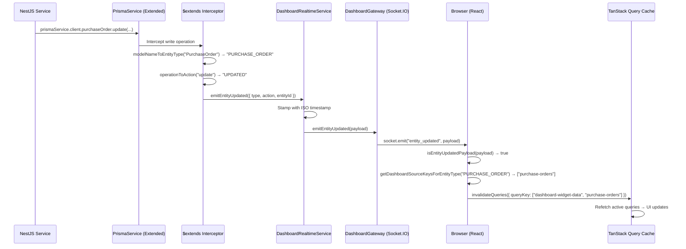

# ADR-0001: Prisma `$extends` Real-Time Sync via WebSocket

## Status

**Accepted** — 2026-04-12

## Amendment (2026-09-01) — site rooms

[ADR-0022](2026-08-31-site-operational-scope.md) adds operational **site rooms** (`site:{siteId}`) and two events on the existing private user room:

- **`site_context_updated`** `{ siteId }` (or `null`) — every socket for that user leaves the previous site room and joins the new one (or no site room).
- **`site_access_scope_updated`** — membership grant/revoke/deactivate, including a site that is not the active site and including `TenantMember` suspend.

The private user room identity is the existing gateway prefix **`user_{firebaseUid}`** (`DashboardGateway.USER_ROOM_PREFIX`; `socket.data.userId` is the Firebase UID). Tenant rooms stay for tenant-wide entities. Operational entity events emit to the document’s site room. Transfer mutations also fan out to both endpoint site rooms and to member user rooms. Isolation is server-side; clients do not join every membership site room while viewing one shop.

This amendment does not change Layer 1 (`Prisma.$extends`) or tenant-room routing. Details: ADR-0022 §5 and the Multi-Location Feature Spec.

## Context

Auto Core Platform has a dashboard that displays live widget data sourced from multiple domain entities (Purchase Orders, Sales Orders, Inventory, Workshop Orders, etc.). Without real-time synchronization the UI becomes stale immediately after any mutation, forcing users to manually refresh.

We needed a mechanism that:

1. **Automatically** emits change events on every database write — without requiring each service to add manual event-emission boilerplate.
2. **Targets only supported entities** to avoid noise from internal / audit tables.
3. **Invalidates the correct TanStack Query caches** on the frontend so widgets update in real-time.
4. Works across all Prisma write operations: `create`, `update`, `delete`, `updateMany`, `deleteMany`, and `upsert`.

## Decision

We implemented a **three-layer architecture** using Prisma Client Extensions, a NestJS WebSocket Gateway, and a React context provider.

### Layer 1 — Prisma Client Extension (Backend)

**File:** `apps/core-api/src/prisma/prisma-dashboard-realtime.extension.ts`

A Prisma Client Extension created via `Prisma.defineExtension()` intercepts every write operation on `$allModels`:

```typescript
export function createDashboardRealtimeExtension(
  dashboardRealtime: DashboardRealtimeService,
) {
  return Prisma.defineExtension({
    name: 'dashboard-realtime',
    query: {
      $allModels: {
        async create({ model, args, query }) { /* ... */ },
        async update({ model, args, query }) { /* ... */ },
        async delete({ model, args, query }) { /* ... */ },
        async updateMany({ model, args, query }) { /* ... */ },
        async deleteMany({ model, args, query }) { /* ... */ },
        async upsert({ model, args, query }) { /* ... */ },
      },
    },
  });
}
```

**Key behaviors:**

| Concern | Implementation |
|---------|---------------|
| **Model filtering** | `modelNameToEntityType()` converts PascalCase model names to SCREAMING_SNAKE_CASE and checks against a whitelist (`SUPPORTED_ENTITY_TYPES`). Unsupported models are silently skipped. |
| **Operation mapping** | `operationToAction()` maps Prisma operations to domain actions: `CREATED`, `UPDATED`, `DELETED`. |
| **Entity ID extraction** | `extractEntityId()` safely pulls the `id` field from the result. Batch operations (`updateMany`, `deleteMany`) omit the entity ID since multiple rows are affected. |
| **Upsert handling** | A pre-check `findFirst` determines whether the upsert will create or update, then emits the correct action. |

**Supported entity types (current):**

| Entity Type | Prisma Model |
|-------------|-------------|
| `PURCHASE_ORDER` | `PurchaseOrder` |
| `PURCHASE_INVOICE` | `PurchaseInvoice` |
| `WORKSHOP_ORDER` | `WorkshopOrder` |
| `SALES_ORDER` | `SalesOrder` |
| `CATALOG_ITEM` | `CatalogItem` |
| `CUSTOMER` | `Customer` |
| `VENDOR` | `Vendor` |
| `VEHICLE` | `Vehicle` |

**Registration in PrismaService:**

```typescript
// apps/core-api/src/prisma/prisma.service.ts
this.client = this.$extends(
  createDashboardRealtimeExtension(dashboardRealtime),
) as PrismaClient;
```

All services must use `prismaService.client` (the extended client) for writes to trigger real-time events.

---

### Layer 2 — Dashboard Realtime Service & Gateway (Backend)

**Module:** `apps/core-api/src/dashboard-realtime/`

```
dashboard-realtime/
├── dashboard-realtime.module.ts    ← @Global() module
├── dashboard-realtime.service.ts   ← Orchestration service
├── dashboard.gateway.ts            ← Socket.IO WebSocket gateway
└── dashboard-events.types.ts       ← Shared type definitions
```

**DashboardRealtimeService** — Stamps each event with an ISO timestamp and delegates to the gateway:

```typescript
emitEntityUpdated(input: EmitDashboardEntityUpdatedInput): void {
  const payload: DashboardEntityUpdatedPayload = {
    ...input,
    timestamp: new Date().toISOString(),
  };
  this.dashboardGateway.emitEntityUpdated(payload);
}
```

**DashboardGateway** — A Socket.IO WebSocket gateway on namespace `/dashboard-realtime` with path `/api/socket.io`:

- CORS origins resolved from `FRONTEND_URL` env var (comma-separated).
- In production, missing `FRONTEND_URL` throws a hard error.
- In dev, falls back to permissive CORS with a console warning.
- Emits the `entity_updated` event to all connected clients.

**Event payload shape:**

```typescript
interface DashboardEntityUpdatedPayload {
  type: DashboardEntityType;       // e.g. 'PURCHASE_ORDER'
  action: DashboardEntityAction;   // 'CREATED' | 'UPDATED' | 'DELETED'
  entityId?: string;               // UUID, absent for batch operations
  timestamp: string;               // ISO 8601
}
```

---

### Layer 3 — Frontend Sync Provider (React)

**File:** `apps/core-web/src/features/realtime/RealtimeDashboardSyncProvider.tsx`

A React context provider wraps the app (`App.tsx`) and:

1. Connects to the Socket.IO namespace `/dashboard-realtime` on mount.
2. Listens for `entity_updated` events.
3. Validates incoming payloads via `isEntityUpdatedPayload()` type guard.
4. Maps the entity type to TanStack Query cache keys via `getDashboardSourceKeysForEntityType()`.
5. Calls `queryClient.invalidateQueries()` for each matching key with `refetchType: 'active'` (only re-fetches currently rendered queries).

**Entity → Query Key mapping** (`dashboard-entity-map.ts`):

| Entity Type | Query Keys Invalidated |
|-------------|----------------------|
| `PURCHASE_ORDER` | `['dashboard-widget-data', 'purchase-orders']` |
| `PURCHASE_INVOICE` | `['dashboard-widget-data', 'purchase-bills']` |
| `WORKSHOP_ORDER` | `['dashboard-widget-data', 'workshop-orders']` |
| `SALES_ORDER` | `['dashboard-widget-data', 'sales-orders']` |
| `CATALOG_ITEM` | `['dashboard-widget-data', 'inventory']` |
| `CUSTOMER` | `['dashboard-widget-data', 'customers']` |
| `VENDOR` | `['dashboard-widget-data', 'vendors']` |
| `VEHICLE` | `['dashboard-widget-data', 'vehicles']` |

---

## Data Flow Diagram



## Consequences

### Positive

- **Zero boilerplate** — Services never need to manually emit WebSocket events. The Prisma extension intercepts all writes automatically.
- **Consistent** — Every supported entity mutation triggers a real-time event, eliminating missed updates.
- **Type-safe** — Both backend and frontend use strict union types (`DashboardEntityType`, `DashboardEntityAction`) preventing typo-based bugs.
- **Selective invalidation** — Only active dashboard queries for the affected entity type are refetched, minimizing network overhead.
- **Extensible** — Adding a new entity to real-time sync requires just two changes: add to `SUPPORTED_ENTITY_TYPES` (backend) and `entityToDashboardSourceKeys` (frontend).
- **Tenant, user, and (from ADR-0022) site room scoping** — Events are routed to tenant-isolated rooms (`tenant_{tenantId}`), user-specific rooms (`user_{firebaseUid}`), and operational site rooms (`site:{siteId}`). See the 2026-09-01 amendment.

### Negative

- **Prisma coupling** — The extension mechanism is tightly coupled to Prisma's `$extends` API. A future ORM migration would require reimplementing this layer.
- **No guaranteed delivery** — WebSocket events are fire-and-forget. If a client disconnects during an event, that update is lost (mitigated by TanStack Query's background refetching on reconnect).
- **Upsert overhead** — The `upsert` handler performs an extra `findFirst` query to distinguish create from update, adding a minor DB round-trip.

### Neutral

- The `@Global()` module decorator makes `DashboardRealtimeService` available to all modules without explicit imports.
- The extension runs after the Prisma query completes (post-query hook), so it never blocks or delays the original database operation.
- **Horizontal Multi-Instance Scaling**: Production uses Upstash (`rediss://` in GSM `REDIS_URL`) with `@socket.io/redis-adapter`. Cloud Run does not use Memorystore or a VPC connector. When `REDIS_URL` is unset, the in-memory adapter is used for local dev and e2e. See `docs/internal/05-Runbooks/socketio-redis-scaling-runbook.md`.

## Alternatives Considered

| Option | Pros | Cons |
|--------|------|------|
| **Manual emit in each service** | Full control; no Prisma coupling. | Boilerplate; easy to forget; inconsistent coverage. |
| **Prisma Middleware (deprecated)** | Familiar pattern. | Officially deprecated by Prisma in favor of `$extends`. |
| **Database triggers + LISTEN/NOTIFY** | Guaranteed delivery from DB level. | PostgreSQL-specific; complex setup; harder to test; payload size limits. |
| **Polling from frontend** | Simplest; no WebSocket infrastructure. | High latency; wastes bandwidth; poor UX at scale. |

## How to Add a New Entity

1. **Backend** — Add the entity type string to `SUPPORTED_ENTITY_TYPES` in `prisma-dashboard-realtime.extension.ts` and to the `DashboardEntityType` union in `dashboard-events.types.ts`.
2. **Frontend** — Add a mapping entry in `entityToDashboardSourceKeys` inside `dashboard-entity-map.ts`, and add the type to `RealtimeEntityType` in `types.ts`.
3. Verify the Prisma model name converts correctly via `modelNameToEntityType()` (PascalCase → SCREAMING_SNAKE_CASE).

## References

- [Prisma Client Extensions docs](https://www.prisma.io/docs/orm/prisma-client/client-extensions)
- ADR-0022: [Site is request-scoped operational ownership](2026-08-31-site-operational-scope.md) — site rooms, `site_context_updated`, `site_access_scope_updated`
- `RealtimeDashboardSyncProvider` implementation: `apps/core-web/src/features/realtime/RealtimeDashboardSyncProvider.tsx`
- Runbook: `docs/internal/05-Runbooks/socketio-redis-scaling-runbook.md`
- Source files:
  - `apps/core-api/src/prisma/prisma-dashboard-realtime.extension.ts`
  - `apps/core-api/src/dashboard-realtime/dashboard-realtime.service.ts`
  - `apps/core-api/src/dashboard-realtime/dashboard.gateway.ts`
  - `apps/core-api/src/dashboard-realtime/dashboard-events.types.ts`
  - `apps/core-web/src/features/realtime/RealtimeDashboardSyncProvider.tsx`
  - `apps/core-web/src/features/realtime/dashboard-entity-map.ts`
