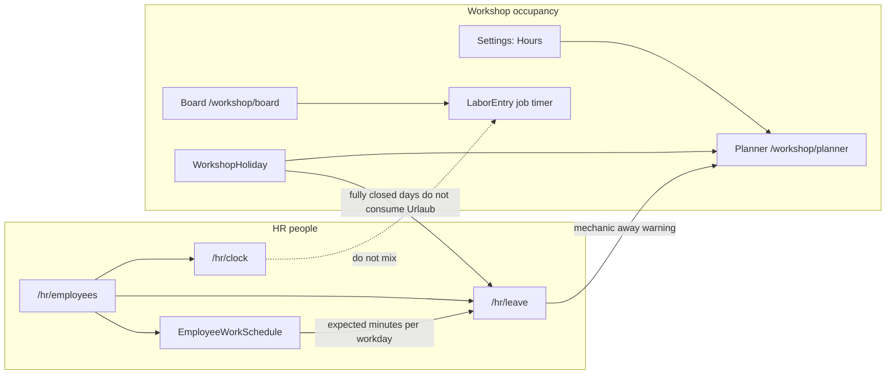

# HR Time and Leave

## Summary

The workshop already knows **when the shop is open** (Planner hours + `WorkshopHoliday`) and **who is on a job** (`LaborEntry` on a workshop task). It does not know whether a person came to work, went on pause, went to the doctor, went home, **when they are expected to work**, or **how much leave time they have left**.

This module adds **HR** as a first-class product area: one `Employee` roster (already used by the board), an append-only **attendance clock** (Come to work / Pause / Doctor / Go home), **versioned employee work schedules**, and **personal leave** with a remaining balance in **minutes**. Shop public holidays stay workshop-owned and only feed chargeable-minute math so Nationalfeiertag does not consume Urlaub.

**Phase 1 (shipped):** attendance clock, day-based leave, planner away overlay.

**Phase 2 (this amendment):** employee work schedules (`EmployeeWorkSchedule`), leave entitlement and bookings in **minutes** (replacing days), so mid-year working-hour changes and part-time patterns do not break leave math.

**Permanently out of scope:** payroll, wages, hourly pay rates, earnings, overtime premiums, works council, sick-leave days (Krankenstand), half-days, leave approval workflow, shared-door PIN kiosk, live OpenHolidays from HR, requiring clock-in before starting a job, merging HR into the kanban, expected-vs-actual hours reports.

Architecture detail lives in [ADR-0020](../../01-ADR/2026-08-22-hr-time-and-leave.md) (amended 2026-08-24).

---

## Approaches considered

| Approach | What it is | Verdict |
|----------|------------|---------|
| **A. Stretch `LaborEntry` + `WorkshopHoliday`** | Clock pauses reuse job timers; employee leave reuses shop-closed days. | **Rejected.** Job pause is `WAITING_PARTS`, not Arzt. Nationalfeiertag is not Urlaub. |
| **B. New HR module, reuse `Employee`** | One person record. `AttendanceEvent` + `LeaveRequest` + yearly balance + work schedules. Shop holidays only for chargeable-minute math. | **Chosen.** |
| **C. Full HCM** | Contracts, payroll, overtime law, sick-note PDFs, kiosk PIN. | **Rejected.** YAGNI — HR tracks time planning only. |
| **G. Keep day-based leave** | Phase 1 model. | **Rejected in Phase 2.** Breaks when hours change mid-year or differ per employee. |
| **I. Shop hours only, no per-employee schedule** | All employees assumed shop hours. | **Rejected.** Cannot model part-time or personal patterns. |

---

## User Stories

### Phase 1 (shipped)

- As a **Workshop Manager**, I want to **add and edit employees in HR** so that **hire date and leave allowance live with the same people the board already uses**.
- As an **Employee**, I want to **punch Come to work, Pause, Doctor, and Go home** so that **the shop has a timesheet that is not a job card**.
- As a **Mechanic**, I want those **same four buttons on the tablet queue** so that **I do not leave the mechanic shell to clock**.
- As an **Employee**, I want to **see remaining holiday time and book a date range** so that **I can track Urlaub without a spreadsheet**.
- As a **Workshop Manager**, I want to **see who is on leave this month** so that **I do not plan a stall around someone who is away**.
- As a **Service Advisor**, I want the **planner to warn when a mechanic is on leave** so that **I still can book the bay, but I see the person is away**.

### Phase 2 (this amendment)

- As a **Workshop Manager**, I want to **set each employee's expected work schedule** so that **part-time and custom hours are tracked separately from shop bay hours**.
- As a **Workshop Manager**, I want to **change an employee's schedule mid-year with an effective date** so that **future leave bookings charge the correct minutes without rewriting past bookings**.
- As an **Employee**, I want **leave charged in minutes** so that **a week off costs the right amount of time whether I work 7.5 h or 4 h days**.
- As a **Workshop Manager**, I want to **enter "25 days" allowance in the UI** so that **the system stores minutes using my employee's current average workday** — I never think about payroll.

---

## Relationship to existing surfaces



| Surface | Question it answers |
|---------|---------------------|
| **Planner** | When is a **bay** free? Shop holidays close or shorten the grid. |
| **Board** | Who owns the stall **right now**? |
| **LaborEntry** | How long was this mechanic on **this task**? |
| **HR Employees** | Who works here, hire date, work schedule, yearly leave allowance (minutes). |
| **HR Clock** | Is this **person** at work, on pause, at the doctor, or home? |
| **HR Leave** | Which days is this person on holiday, and how many **minutes** remain? |
| **EmployeeWorkSchedule** | **When** and **how long** should this person work on each weekday? |

Do not put attendance buttons on the kanban. Do not store employee leave as `WorkshopHoliday` rows. Do not use `LaborOperation.hourly_rate` for employee compensation.

---

## Proposed product rulings

These are binding for implementation unless Product Owner overrides them in review.

### Phase 1 (unchanged unless noted)

1. **HR owns people; Settings Employees is a shortcut.** One CRUD. Sidebar item **HR** at `/hr/employees` with page tabs Employees / Time Clock / Leave. Settings → Employees renders the same employee table (or redirects to `/hr/employees`).
2. **Do not add a second person table.** Extend `Employee` with `hired_on` and `annual_leave_minutes` (Phase 2 replaces `annual_leave_days`). Keep `TenantMember` as login. Self-service clock and leave require `Employee.user_id` linked to the session user.
3. **Attendance is an append-only `AttendanceEvent` log**, not `LaborEntry`. Buttons: **Come to work**, **Pause**, **Doctor**, **Go home**. Derived state from the latest event. Invalid transition → `409`. Attendance is **not** multiplied by any pay rate.
4. **Doctor is a mid-shift clock state**, not Krankenstand. Full sick-leave days are deferred.
5. **Leave is employee self-service.** Book a date range; remaining updates immediately (computed from BOOKED rows). No REQUESTED → APPROVED. OWNER/ADMIN can edit or cancel any booking. An employee may cancel their own leave when `start_on` is today or later.
8. **Planner overlay is a warning, not 409.** BOOKED leave on a mechanic is amber on `GET /api/workshop/planner`. Bays can still be booked.
9. **Clocking in does not start a job; starting a job does not require being clocked in.**
11. **Out of scope:** payroll, wages, earnings, overtime, works council, school holidays, OpenHolidays from HR, merging HR into the kanban.
12. **Session identity is Firebase UID, not `Employee.user_id`.** Resolve "me" via `User.firebaseUid` / `email`. Do **not** call `resolveMechanic()` for HR.
13. **Nightly auto-close matches `LaborEntry`.** Cron `59 23 * * *`, `CLOCK_OUT` / `AUTO_SHIFT_CLOSE` with `occurred_at = now()`.
14. **Clock-in is allowed on a BOOKED leave day.** No 409 from leave onto attendance.
17. **`created_by_user_id` is Postgres `User.id`**, not Firebase UID. Nullable; no FK.

### Phase 2 (minutes & schedules)

6. **Remaining minutes = allowance + carryover − sum(`minutes_charged`) of BOOKED leave in that calendar year.** Chargeable minutes use the algorithm in § Workday / minute charging below. `minutes_charged` is snapshotted at book/patch time; later schedule or shop-hour edits do not rewrite old bookings. A booking may not span two calendar years (`400`). Zero chargeable minutes → `400`.
7. **Default allowance 25 days (AT-style) at create**, stored as `annual_leave_minutes = 25 × avg_expected_minutes_per_workday` in the same transaction as schedule seed. `annual_leave_minutes` has **no** `@default(25)` on the column. Copied onto that year's `EmployeeLeaveBalance.allowance_minutes` on first `GET /api/hr/me/leave` or first leave create. **Dual-write (ruling 7):** `POST/PATCH /api/employees` that sets `annualLeaveMinutes` must also set current local-year `allowance_minutes` when a balance row exists. `PATCH .../leave-balance` `allowanceMinutes` for the current local year must also set `Employee.annual_leave_minutes`. Carryover PATCH is in minutes (if UI accepts "days", convert at save with current `avg`).
10. **RBAC (Phase 2 additions).** `hiredOn`, `annualLeaveMinutes`, work schedule **writes**, and leave-balance writes are OWNER/ADMIN only (`403` for SALES). SALES may **read** work schedules (`GET /api/hr/employees/:id/work-schedule`). SALES keeps roster write on `/api/employees` (name / role / active / user link).
15. **Chargeable leave minutes** use employee schedule + shop fully-closed gate (see algorithm). Short shop holidays (`is_closed = false`) charge **full employee workday minutes**, not the shop's shortened window.
16. **`remainingLeaveMinutes` is always a number.** If no balance row exists, use `annualLeaveMinutes + 0 carryover − 0 booked`. Never return null. UI may show derived `approxRemainingDays = remainingMinutes / current_avg` (display only).
18. **Employee work schedule is versioned.** POST new version with later `effective_from`; PATCH corrects times on existing version (`effective_from` immutable on PATCH). Exactly seven ISO weekday rows (1–7) required on POST/PATCH; missing weekday → `400`. Duplicate `effective_from` → `409`. Schedule rows cascade on employee hard-delete — **not** a separate 409 reason.
19. **"Current" schedule** for `avg`, UI, and granting allowance: greatest `effective_from <= tenant-local today`. Not `max(effective_from)` when a future version exists.
20. **Zero `is_working` days in current schedule:** use `480` minute fallback for `avg` (same as no opening-hour rows).
21. **`EmployeeWorkSchedule` is audited** (`updatedAt`, `AUDITED_MODELS`). Day children are not individually audited.

---

## Database Impact

### Modified Tables

| Table | Phase 1 (shipped) | Phase 2 change | Migration Required? |
|-------|-------------------|----------------|---------------------|
| `employees` | `hired_on`, `annual_leave_days` | Replace `annual_leave_days` → `annual_leave_minutes Int @default(0)` (no `@default(25)`) | Yes |
| `employee_leave_balances` | `allowance_days`, `carryover_days` | → `allowance_minutes`, `carryover_minutes` | Yes |
| `leave_requests` | `days_charged` | → `minutes_charged` | Yes |
| `tenants` | Relations to HR tables | Add `EmployeeWorkSchedule` relations | Yes |

### New Tables (Phase 2)

#### `EmployeeWorkSchedule`

Versioned expected work pattern per employee.

| Column | Type | Nullable | Default | Notes |
|--------|------|----------|---------|-------|
| `id` | `String @id @default(uuid())` | No | UUID | |
| `tenant_id` | `String` | No | — | Tenant isolation |
| `employee_id` | `String` | No | — | Composite FK; `onDelete: Cascade` |
| `effective_from` | `DateTime @db.Date` | No | — | First day this version applies |
| `createdAt` | `DateTime` | No | `now()` | |
| `updatedAt` | `DateTime` | No | `@updatedAt` | Audited |

```prisma
model EmployeeWorkSchedule {
  id             String   @id @default(uuid())
  tenant_id      String
  tenant         Tenant   @relation(fields: [tenant_id], references: [id])
  employee_id    String
  employee       Employee @relation(fields: [tenant_id, employee_id], references: [tenant_id, id], onDelete: Cascade)
  effective_from DateTime @db.Date
  days           EmployeeWorkScheduleDay[]
  createdAt      DateTime @default(now())
  updatedAt      DateTime @updatedAt

  @@unique([tenant_id, id])
  @@unique([tenant_id, employee_id, effective_from])
  @@index([tenant_id])
  @@map("employee_work_schedules")
}
```

#### `EmployeeWorkScheduleDay`

Seven rows per schedule version (ISO weekdays 1–7).

| Column | Type | Nullable | Default | Notes |
|--------|------|----------|---------|-------|
| `weekday` | `Int` | No | — | ISO 1–7, same as `WorkshopOpeningHour` |
| `is_working` | `Boolean` | No | — | |
| `start_time` | `String?` | Yes | — | `HH:MM`; required when `is_working` |
| `end_time` | `String?` | Yes | — | |
| `break_minutes` | `Int` | No | `0` | Door-to-door window minus break |

```prisma
model EmployeeWorkScheduleDay {
  id            String               @id @default(uuid())
  tenant_id     String
  tenant        Tenant               @relation(fields: [tenant_id], references: [id])
  schedule_id   String
  schedule      EmployeeWorkSchedule @relation(fields: [tenant_id, schedule_id], references: [tenant_id, id], onDelete: Cascade)
  weekday       Int
  is_working    Boolean
  start_time    String?
  end_time      String?
  break_minutes Int                  @default(0)

  @@unique([tenant_id, id])
  @@unique([tenant_id, schedule_id, weekday])
  @@index([tenant_id])
  @@map("employee_work_schedule_days")
}
```

**Seed on employee create:** copy tenant `WorkshopOpeningHour` (`is_working = !is_closed`, times copied, `break_minutes = 0`), `effective_from = hired_on` or tenant-local today. Set `annual_leave_minutes = 25 × avg` in same transaction.

**Migration backfill:** one schedule per existing employee from shop hours; convert all day columns with single `avg` factor per employee (`minutes = days × avg`) so remaining is invariant.

### Existing Tables (updated field names)

#### `EmployeeLeaveBalance`

| Column | Phase 2 |
|--------|---------|
| `allowance_minutes` | Copied from `Employee.annual_leave_minutes` on first upsert |
| `carryover_minutes` | Manager-edited; default `0` |

#### `LeaveRequest`

| Column | Phase 2 |
|--------|---------|
| `minutes_charged` | Snapshot of chargeable minutes at book/patch time |

#### `AttendanceEvent`

Unchanged from Phase 1 (see ADR-0020 §2).

On `Employee` (Phase 2 target):

```prisma
hired_on              DateTime? @db.Date
annual_leave_minutes  Int       @default(0)
workSchedules         EmployeeWorkSchedule[]
leaveBalances         EmployeeLeaveBalance[]
leaveRequests         LeaveRequest[]
attendanceEvents      AttendanceEvent[]
```

### Attendance state machine

Unchanged from Phase 1. See shipped implementation in `HrAttendanceService`.

### Workday / minute charging

Replace Phase 1 `countChargeableDays` with `countChargeableMinutes(employeeId, from, to)` in `HrWorkdayService`. Remove `countChargeableDays` after migration.

**`avg_expected_minutes_per_workday`:** Mean of `(end_time − start_time) − break_minutes` over `is_working` weekdays in the **current** schedule (greatest `effective_from <= tenant-local today`). Zero working days → `480` fallback.

**Algorithm** for `[start_on, end_on]` inclusive:

```
for each date D in range:
  schedule = latest EmployeeWorkSchedule where effective_from <= D
  weekday  = ISO weekday of D
  if !schedule.days[weekday].is_working → 0
  if shop fully closed on D
     (weekday WorkshopOpeningHour.is_closed, or matching WorkshopHoliday.is_closed)
     → 0
  else → (end_time − start_time) − break_minutes

minutes_charged = Σ charge for each D
```

- `end_time <= start_time` or `break_minutes` ≥ span → `400`. No overnight shifts.
- Short `WorkshopHoliday` (`is_closed = false`) charges **full employee minutes** for that date.
- If total is `0`, reject booking with `400`.
- Missing schedule version for any date in the range → `400` (do not charge 0 and proceed).
- Do **not** call OpenHolidays from HR. Reuse planner helpers from `HrWorkdayService`.

### Deletion Policy Impact

| Entity | Delete Allowed | Rule |
|--------|----------------|------|
| Employee | Soft-disable preferred | Hard delete blocked if `AttendanceEvent`, `LeaveRequest`, `EmployeeLeaveBalance`, or workshop refs exist. **Schedule rows cascade** — not a separate 409. |
| EmployeeWorkSchedule | No API delete | Cascade on employee/tenant purge. Parent PATCH audited. |
| EmployeeWorkScheduleDay | No API delete | Cascade with parent schedule. |
| EmployeeLeaveBalance | No API delete | PATCH allowance/carryover only. |
| LeaveRequest | Soft-cancel | `status = CANCELLED`. No hard delete. |
| AttendanceEvent | No | Immutable punch log. |

Update `docs/deletion-policy.md` when Phase 2 schema ships ([AUT-197](https://linear.app/auto-core-platform/issue/AUT-197)).

---

## API Contract Changes

Keep `/api/employees` as the employee CRUD surface. Clock, leave, and schedules live under `/api/hr`.

### Modified Endpoints (Phase 2 breaking renames)

| Method | Route | Change |
|--------|-------|--------|
| `GET/POST/PATCH /api/employees` | `hiredOn`, `annualLeaveMinutes` (not `annualLeaveDays`). List/detail return `remainingLeaveMinutes` (always a number) and optional `approxRemainingDays` (display). Write of `hiredOn` / `annualLeaveMinutes` is OWNER/ADMIN only. Setting `annualLeaveMinutes` updates current-year `allowance_minutes` when balance row exists. |
| `GET /api/workshop/planner` | Unchanged: `employeesAway` date-based overlay. |

**OpenAPI renames:**

| Phase 1 | Phase 2 |
|---------|---------|
| `annualLeaveDays` | `annualLeaveMinutes` |
| `remainingLeaveDays` | `remainingLeaveMinutes` |
| `allowanceDays` | `allowanceMinutes` |
| `carryoverDays` | `carryoverMinutes` |
| `remainingDays` | `remainingMinutes` |
| `daysCharged` | `minutesCharged` |

### Phase 1 Endpoints (field names updated to minutes)

| Method | Route | Response notes (Phase 2) |
|--------|-------|--------------------------|
| `GET` | `/api/hr/me/leave` | `{ year, allowanceMinutes, carryoverMinutes, remainingMinutes, approxRemainingDays?, bookings[] }` |
| `POST` | `/api/hr/me/leave` | Returns `minutesCharged` on `LeaveRequest` |
| `POST` | `/api/hr/leave` | `{ employeeId, startOn, endOn, note? }` — OWNER/ADMIN books for another employee; returns `minutesCharged` |
| `PATCH` | `/api/hr/leave/:id` | Recomputes `minutesCharged` for new range |
| `PATCH` | `/api/hr/employees/:id/leave-balance` | `{ year, allowanceMinutes?, carryoverMinutes? }` |

Leave create errors (minutes):

- Overlap → `409`
- `minutesCharged > remainingMinutes` → `409` (`Not enough remaining leave time`)
- `endOn < startOn` → `400`
- Cross-year range → `400`
- Zero chargeable minutes → `400`

### New Endpoints (Phase 2)

| Method | Route | Request | Response | Auth |
|--------|-------|---------|----------|------|
| `GET` | `/api/hr/employees/:id/work-schedule` | — | Current schedule + full version history | OWNER/ADMIN; SALES read |
| `POST` | `/api/hr/employees/:id/work-schedule` | `{ effectiveFrom, days[7] }` | New schedule version | OWNER/ADMIN |
| `PATCH` | `/api/hr/employees/:id/work-schedule/:scheduleId` | `{ days[7] }` — `effectiveFrom` ignored | Updated version | OWNER/ADMIN |

**POST body example:**

```json
{
  "effectiveFrom": "2026-07-01",
  "days": [
    { "weekday": 1, "isWorking": true,  "startTime": "07:30", "endTime": "17:00", "breakMinutes": 0 },
    { "weekday": 2, "isWorking": true,  "startTime": "07:30", "endTime": "17:00", "breakMinutes": 0 },
    { "weekday": 3, "isWorking": true,  "startTime": "07:30", "endTime": "17:00", "breakMinutes": 0 },
    { "weekday": 4, "isWorking": true,  "startTime": "07:30", "endTime": "17:00", "breakMinutes": 0 },
    { "weekday": 5, "isWorking": true,  "startTime": "07:30", "endTime": "17:00", "breakMinutes": 0 },
    { "weekday": 6, "isWorking": false, "startTime": null,   "endTime": null,   "breakMinutes": 0 },
    { "weekday": 7, "isWorking": false, "startTime": null,   "endTime": null,   "breakMinutes": 0 }
  ]
}
```

Schedule errors:

- Duplicate `effectiveFrom` → `409`
- Fewer or more than 7 weekdays → `400`
- `isWorking: true` without both times → `400`
- `isWorking: false` with non-null `startTime` or `endTime` → `400`
- `endTime <= startTime` → `400`
- SALES POST/PATCH → `403` (GET is allowed for SALES)
- Missing schedule version for a chargeable date `D` during leave booking → `400` (should not occur after seed/migration; do not silently charge 0)

### OpenAPI Regeneration

- [ ] `npm --prefix apps/core-api run openapi:generate`
- [ ] `npm --prefix apps/core-web run api:types:generate`

---

## UX Compliance

### Layout & Actions

- [ ] Page-level actions top-right.
- [ ] Top-left reserved for title / tabs / badges.

### List Pages

- [ ] Employees: `+ Employee`, row click opens sheet with hire date, **work schedule**, leave allowance (minutes with optional "≈ X days"), carryover, remaining, linked login. Schedule + allowance OWNER/ADMIN only.
- [ ] Leave list: `minutesCharged` on bookings; remaining chip in minutes.

### Form Handling

- [ ] Employee allowance: UI may accept "25 days" but persists `25 × avg` minutes.
- [ ] Work schedule: POST new version (effective date + 7 weekdays) or PATCH correction on existing version.
- [ ] Clock and leave booking: unchanged interaction patterns from Phase 1.

### Real-Time Sync

- [ ] Add `EMPLOYEE_WORK_SCHEDULE` to `DashboardEntityType`, `SUPPORTED_ENTITY_TYPES`, frontend entity map.
- [ ] Existing `ATTENDANCE_EVENT` and `LEAVE_REQUEST` keys unchanged.

---

## Component Design

| Component | Location | Phase 2 change |
|-----------|----------|----------------|
| `HrEmployeesPage` / employee sheet | `apps/core-web/src/pages/hr/` | Work schedule editor section |
| `EmployeeTable` | `apps/core-web/src/components/hr/` | `remainingLeaveMinutes` + optional approx days |
| `LeaveBookingSheet` | `apps/core-web/src/components/hr/` | Show `minutesCharged` after submit |
| `HrLeavePage` | `apps/core-web/src/pages/hr/` | Remaining minutes chip |

New query key:

```typescript
workSchedule: (employeeId: string) =>
  [...hrKeys.all, 'work-schedule', employeeId] as const,
```

---

## Testing Plan

### Backend (Phase 2 additions)

- [ ] `countChargeableMinutes`: closed Sunday + closed holiday → 0
- [ ] Short holiday (`is_closed = false`) charges full employee minutes
- [ ] Mid-year schedule change: same calendar week charges different minutes before/after `effective_from`
- [ ] POST schedule: 7 weekdays required; duplicate `effective_from` → `409`
- [ ] PATCH schedule: `effectiveFrom` ignored; times corrected
- [ ] `avg` uses current schedule (today), not future version
- [ ] Zero `is_working` days → `480` avg fallback
- [ ] Migration: remaining minutes invariant (`remaining_days × avg`)
- [ ] Employee hard-delete with only schedule rows succeeds (cascade)
- [ ] SALES `403` on schedule POST/PATCH and `annualLeaveMinutes`; SALES `200` on schedule GET
- [ ] No `hourly_rate` / wage fields on HR schema (grep test)
- [ ] All Phase 1 attendance/leave tests updated for minute field names

### Frontend (Phase 2)

- [ ] Vitest: schedule editor validates 7 weekdays
- [ ] Vitest: leave sheet uses minute fields
- [ ] Allowance input "25 days" converts to minutes at save

---

## Inventory Impact

None.

---

## Fiscal Impact

None. Attendance, schedules, and leave are not invoices and do not touch `lock_date`. No payroll or earnings.

---

## RBAC

| Role | Employees | Work schedule | Own clock | Team timesheet | Own leave | Team leave | Balance edit |
|------|-----------|---------------|-----------|----------------|-----------|------------|--------------|
| OWNER / ADMIN | Full | Read/write | Yes (if linked) | Full | Yes | Full | Yes |
| SALES | Roster write; HR fields read-only | Read only | Yes | No | Yes | Read | No |
| TECH | No (mechanic shell) | No | Yes | No | API only | No | No |

---

## Implementation sequence

### Phase 1 (shipped)

See [2026-08-22-hr-time-and-leave-implementation-plan.md](2026-08-22-hr-time-and-leave-implementation-plan.md). AUT-180–AUT-185.

### Phase 2 (this amendment)

| Order | Issue | Work |
|-------|-------|------|
| 1 | [AUT-193](https://linear.app/auto-core-platform/issue/AUT-193) | Prisma: `EmployeeWorkSchedule` + days→minutes migration |
| 2 | [AUT-194](https://linear.app/auto-core-platform/issue/AUT-194) | `HrWorkdayService` + `HrLeaveService` minute logic |
| 2 | [AUT-195](https://linear.app/auto-core-platform/issue/AUT-195) | Work schedule REST API (parallel with AUT-194 after AUT-193) |
| 3 | [AUT-196](https://linear.app/auto-core-platform/issue/AUT-196) | Frontend schedule editor + minute leave UI |
| 4 | [AUT-197](https://linear.app/auto-core-platform/issue/AUT-197) | Deletion policy + public docs |

Spec amendment: [AUT-192](https://linear.app/auto-core-platform/issue/AUT-192) (this document).

---

## Open Questions

**Resolved 2026-08-22 (Phase 1 PO review).** Rulings 1–17 above (Phase 1 subset) are binding.

**Resolved 2026-08-24 (Phase 2 amendment).** Minutes-based leave, employee work schedules, no earnings scope. See ADR-0020 and rulings 6–7, 10, 15–16, 18–21.

---

## References

- [ADR-0020: HR Time and Leave](../../01-ADR/2026-08-22-hr-time-and-leave.md) (amended 2026-08-24)
- [ADR-0019: Workshop Planner Calendar](../../01-ADR/2026-08-21-workshop-planner-calendar.md)
- [ADR-0018: Workshop Planner Kanban Board](../../01-ADR/2026-04-18-workshop-planner-kanban-board.md)
- [ADR-0014: Mechanic tablet](../../01-ADR/2026-04-27-mechanic-digital-repair-order-tablet-rbac.md)
- [Feature Spec: Workshop Board Resources](../Workshop/workshop-board-resources.md)
- `apps/core-api/src/hr/hr-workday.service.ts`
- `apps/core-api/src/hr/hr-leave.service.ts`

---

## Linear Tracking

| Field | Value |
|-------|-------|
| Project | [HR Time and Leave](https://linear.app/auto-core-platform/project/hr-time-and-leave-7e0299d12e1f) |
| Milestone | Minutes & schedules amendment |
| Issues | [AUT-192](https://linear.app/auto-core-platform/issue/AUT-192) (this spec), [AUT-193](https://linear.app/auto-core-platform/issue/AUT-193)–[AUT-197](https://linear.app/auto-core-platform/issue/AUT-197) (Phase 2 implementation) |
