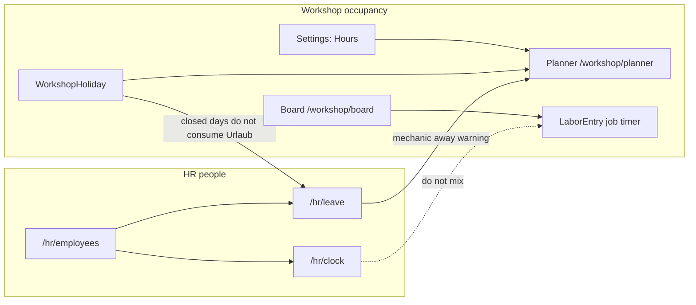

# HR Time and Leave

## Summary

The workshop already knows **when the shop is open** (Planner hours + `WorkshopHoliday`) and **who is on a job** (`LaborEntry` on a workshop task). It does not know whether a person came to work, went on pause, went to the doctor, went home, or how many holiday days they have left.

This module adds **HR** as a first-class product area: one `Employee` roster (already used by the board), an append-only **attendance clock** (Come to work / Pause / Doctor / Go home), and **personal leave** with a remaining-days balance. Shop public holidays stay workshop-owned and only feed workday counting so Nationalfeiertag does not consume Urlaub.

**Out of scope (Phase 1):** payroll, overtime premiums, works council, sick-leave days (Krankenstand), half-days, leave approval workflow, shared-door PIN kiosk, live OpenHolidays from HR, requiring clock-in before starting a job, merging HR into the kanban.

---

## Approaches considered

| Approach | What it is | Verdict |
|----------|------------|---------|
| **A. Stretch `LaborEntry` + `WorkshopHoliday`** | Clock pauses reuse job timers; employee leave reuses shop-closed days. | **Rejected.** Job pause is `WAITING_PARTS`, not Arzt. Nationalfeiertag is not Urlaub. |
| **B. New HR module, reuse `Employee`** | One person record. New `AttendanceEvent` + `LeaveRequest` + yearly balance. Shop holidays only for workday math. | **Chosen.** |
| **C. Full HCM** | Contracts, payroll, overtime law, sick-note PDFs, kiosk PIN. | **Rejected.** YAGNI for a single-shop Phase 1. |

Architecture detail lives in [ADR-0020](../../01-ADR/2026-08-22-hr-time-and-leave.md).

---

## User Stories

- As a **Workshop Manager**, I want to **add and edit employees in HR** so that **hire date and leave allowance live with the same people the board already uses**.
- As an **Employee**, I want to **punch Come to work, Pause, Doctor, and Go home** so that **the shop has a timesheet that is not a job card**.
- As a **Mechanic**, I want those **same four buttons on the tablet queue** so that **I do not leave the mechanic shell to clock**.
- As an **Employee**, I want to **see remaining holiday days and book a date range** so that **I can track Urlaub without a spreadsheet**.
- As a **Workshop Manager**, I want to **see who is on leave this month** so that **I do not plan a stall around someone who is away**.
- As a **Service Advisor**, I want the **planner to warn when a mechanic is on leave** so that **I still can book the bay, but I see the person is away**.

---

## Relationship to existing surfaces



| Surface | Question it answers |
|---------|---------------------|
| **Planner** | When is a **bay** free? Shop holidays close or shorten the grid. |
| **Board** | Who owns the stall **right now**? |
| **LaborEntry** | How long was this mechanic on **this task**? |
| **HR Employees** | Who works here, hire date, yearly allowance. |
| **HR Clock** | Is this **person** at work, on pause, at the doctor, or home? |
| **HR Leave** | Which days is this person on holiday, and how many remain? |

Do not put attendance buttons on the kanban. Do not store employee leave as `WorkshopHoliday` rows.

---

## Proposed product rulings

These are binding for implementation unless Product Owner overrides them in review.

1. **HR owns people; Settings Employees is a shortcut.** One CRUD. Sidebar item **HR** at `/hr/employees` with page tabs Employees / Time Clock / Leave. Settings → Employees renders the same employee table (or redirects to `/hr/employees`).
2. **Do not add a second person table.** Extend `Employee` with `hired_on` and `annual_leave_days`. Keep `TenantMember` as login. Self-service clock and leave require `Employee.user_id` linked to the session user.
3. **Attendance is an append-only `AttendanceEvent` log**, not `LaborEntry`. Buttons: **Come to work**, **Pause**, **Doctor**, **Go home**. Derived state from the latest event. Invalid transition → `409`.
4. **Doctor is a mid-shift clock state**, not Krankenstand. Full sick-leave days are Phase 2.
5. **Leave is employee self-service.** Book a date range; remaining updates immediately (computed from BOOKED rows). No REQUESTED → APPROVED in Phase 1. OWNER/ADMIN can edit or cancel any booking. An employee may cancel their own leave when `start_on` is today or later.
6. **Remaining days = allowance + carryover − sum(`days_charged`) of BOOKED leave in that calendar year.** Closed weekdays and closed `WorkshopHoliday` dates are **not** charged. Short shop days still count as `1`. Half-days out of scope. `days_charged` is snapshotted at book time; later hours/holiday edits do not rewrite old bookings. A booking may not span two calendar years (`400`) — book December and January as two ranges.
7. **Default allowance 25 days** (AT-style), stored on `Employee.annual_leave_days` and copied onto the year's `EmployeeLeaveBalance` on first access. Manager types `carryover_days`. No year-end job.
8. **Planner overlay is a warning, not 409.** BOOKED leave on a mechanic is amber on `GET /api/workshop/planner`. Bays can still be booked. Same spirit as mechanic double-book in ADR-0019.
9. **Clocking in does not start a job; starting a job does not require being clocked in** in Phase 1.
10. **RBAC.** OWNER/ADMIN: full HR, including punching or correcting another employee. SALES: own clock, own leave, read team leave calendar. TECH: `/api/hr/me/*` only, plus clock buttons on `/mechanic/queue`. No shared-door PIN kiosk.
11. **Out of scope:** payroll, overtime, works council, school holidays, OpenHolidays from HR (planner import already exists), merging HR into the kanban.

---

## Database Impact

### Modified Tables

| Table | Change | Migration Required? |
|-------|--------|---------------------|
| `employees` | Add `hired_on Date?`, `annual_leave_days Int @default(25)` | Yes |
| `tenants` | Relations to new HR tables | Yes (Prisma only) |

### New Tables

#### `EmployeeLeaveBalance`

One row per employee per calendar year. Remaining is **never stored**.

| Column | Type | Nullable | Default | Notes |
|--------|------|----------|---------|-------|
| `id` | `String @id @default(uuid())` | No | UUID | Primary key |
| `tenant_id` | `String` | No | — | Tenant isolation |
| `employee_id` | `String` | No | — | Composite FK `(tenant_id, employee_id)` → `employees` |
| `year` | `Int` | No | — | Gregorian year in tenant timezone |
| `allowance_days` | `Int` | No | — | Copied from `Employee.annual_leave_days` on first upsert |
| `carryover_days` | `Int` | No | `0` | Manager-edited |
| `createdAt` | `DateTime` | No | `now()` | |
| `updatedAt` | `DateTime` | No | `@updatedAt` | |

```prisma
model EmployeeLeaveBalance {
  id             String   @id @default(uuid())
  tenant_id      String
  tenant         Tenant   @relation(fields: [tenant_id], references: [id])
  employee_id    String
  employee       Employee @relation(fields: [tenant_id, employee_id], references: [tenant_id, id], onDelete: Restrict)
  year           Int
  allowance_days Int
  carryover_days Int      @default(0)
  createdAt      DateTime @default(now())
  updatedAt      DateTime @updatedAt

  @@unique([tenant_id, id])
  @@unique([tenant_id, employee_id, year])
  @@index([tenant_id])
  @@map("employee_leave_balances")
}
```

#### `LeaveRequest`

| Column | Type | Nullable | Default | Notes |
|--------|------|----------|---------|-------|
| `id` | `String @id @default(uuid())` | No | UUID | Primary key |
| `tenant_id` | `String` | No | — | Tenant isolation |
| `employee_id` | `String` | No | — | Composite FK to `employees` |
| `start_on` | `DateTime @db.Date` | No | — | Inclusive local date |
| `end_on` | `DateTime @db.Date` | No | — | Inclusive; must be ≥ `start_on` |
| `status` | `LeaveRequestStatus` | No | `BOOKED` | `BOOKED` \| `CANCELLED` |
| `days_charged` | `Int` | No | — | Snapshot of chargeable workdays at book/patch time |
| `note` | `String?` | Yes | — | Optional |
| `created_by_user_id` | `String?` | Yes | — | Session user who created the row |
| `createdAt` | `DateTime` | No | `now()` | |
| `updatedAt` | `DateTime` | No | `@updatedAt` | |

```prisma
enum LeaveRequestStatus {
  BOOKED
  CANCELLED
}

model LeaveRequest {
  id                  String             @id @default(uuid())
  tenant_id           String
  tenant              Tenant             @relation(fields: [tenant_id], references: [id])
  employee_id         String
  employee            Employee           @relation(fields: [tenant_id, employee_id], references: [tenant_id, id], onDelete: Restrict)
  start_on            DateTime           @db.Date
  end_on              DateTime           @db.Date
  status              LeaveRequestStatus @default(BOOKED)
  days_charged        Int
  note                String?
  created_by_user_id  String?
  createdAt           DateTime           @default(now())
  updatedAt           DateTime           @updatedAt

  @@unique([tenant_id, id])
  @@index([tenant_id])
  @@index([tenant_id, employee_id, start_on])
  @@map("leave_requests")
}
```

#### `AttendanceEvent`

Immutable punch log. Corrections are extra rows (`source = MANAGER`), never updates.

| Column | Type | Nullable | Default | Notes |
|--------|------|----------|---------|-------|
| `id` | `String @id @default(uuid())` | No | UUID | Primary key |
| `tenant_id` | `String` | No | — | Tenant isolation |
| `employee_id` | `String` | No | — | Composite FK to `employees` |
| `type` | `AttendanceEventType` | No | — | `CLOCK_IN` \| `PAUSE` \| `DOCTOR` \| `CLOCK_OUT` |
| `source` | `AttendanceEventSource` | No | `SELF` | `SELF` \| `MANAGER` \| `AUTO_SHIFT_CLOSE` |
| `occurred_at` | `DateTime` | No | — | timestamptz |
| `note` | `String?` | Yes | — | Optional |
| `createdAt` | `DateTime` | No | `now()` | No `updatedAt` |

```prisma
enum AttendanceEventType {
  CLOCK_IN
  PAUSE
  DOCTOR
  CLOCK_OUT
}

enum AttendanceEventSource {
  SELF
  MANAGER
  AUTO_SHIFT_CLOSE
}

model AttendanceEvent {
  id           String                 @id @default(uuid())
  tenant_id    String
  tenant       Tenant                 @relation(fields: [tenant_id], references: [id])
  employee_id  String
  employee     Employee               @relation(fields: [tenant_id, employee_id], references: [tenant_id, id], onDelete: Restrict)
  type         AttendanceEventType
  source       AttendanceEventSource  @default(SELF)
  occurred_at  DateTime
  note         String?
  createdAt    DateTime               @default(now())

  @@unique([tenant_id, id])
  @@index([tenant_id])
  @@index([tenant_id, employee_id, occurred_at])
  @@map("attendance_events")
}
```

On `Employee` add:

```prisma
hired_on           DateTime? @db.Date
annual_leave_days  Int       @default(25)
leaveBalances      EmployeeLeaveBalance[]
leaveRequests      LeaveRequest[]
attendanceEvents   AttendanceEvent[]
```

`annual_leave_days` must be `0…365` inclusive (API validation; DB `Int`).

### Attendance state machine

Derived from the employee's **latest event by `occurred_at`** (not only today's).

| Last event | State | Allowed next types |
|------------|-------|--------------------|
| none or `CLOCK_OUT` | `CLOCKED_OUT` | `CLOCK_IN` |
| `CLOCK_IN` | `CLOCKED_IN` | `PAUSE`, `DOCTOR`, `CLOCK_OUT` |
| `PAUSE` | `PAUSED` | `CLOCK_IN` (resume), `CLOCK_OUT` |
| `DOCTOR` | `AT_DOCTOR` | `CLOCK_IN` (resume), `CLOCK_OUT` |

Anything else → `409 Conflict` with the current state in the message.

**Nightly auto-close:** for each employee whose latest event is not `CLOCK_OUT`, insert `CLOCK_OUT` / `source = AUTO_SHIFT_CLOSE` at the end of that event's local day (tenant `WorkshopSettings.timezone`, default `Europe/Vienna`). Reuse the existing mechanic scheduler cadence; implement in `HrAttendanceSchedulerService`, do not write HR rows from `MechanicSchedulerService`.

**One open day:** self-punch `occurred_at` is `now()`. Manager corrections may pass an explicit `occurredAt` that must be after the previous event.

### Workday counting

Chargeable leave days in `[start_on, end_on]` (inclusive):

1. Load tenant `WorkshopOpeningHour` + `WorkshopHoliday` (same effective-hours rule as ADR-0019: matching holiday wins).
2. For each local date in range: **charge 1** if the day is open (weekday not closed, or holiday with `is_closed = false`). **Charge 0** if weekday `is_closed` or holiday `is_closed = true`.
3. Short holiday (`is_closed = false` with holiday hours) still charges **1**.
4. If the count is `0`, reject the booking with `400`.

Do **not** call OpenHolidays from HR. Do **not** duplicate holiday expansion; reuse planner helpers (`workshop-planner.time.ts` / holiday match) from `HrWorkdayService`.

### Deletion Policy Impact

Update `docs/deletion-policy.md` when schema ships:

| Entity | Delete Allowed | Rule |
|--------|----------------|------|
| Employee | Soft-disable preferred | Hard delete blocked if any `AttendanceEvent` or `LeaveRequest` exists (in addition to workshop-order references). |
| EmployeeLeaveBalance | No API delete | Replaced by PATCH of allowance/carryover. Cascade only with tenant purge. |
| LeaveRequest | Soft-cancel | Set `status = CANCELLED`. No hard delete through the API. |
| AttendanceEvent | No | Immutable punch log. Corrections are additional events. |

---

## API Contract Changes

Keep `/api/employees` as the employee CRUD surface (board and Settings already use it). New clock/leave routes live under `/api/hr`.

### Modified Endpoints

| Method | Route | Change |
|--------|-------|--------|
| `GET/POST/PATCH /api/employees` | Add `hiredOn` (`YYYY-MM-DD` \| null), `annualLeaveDays` (int, default 25). List/detail also return computed `remainingLeaveDays` for the current local year (null if no balance row yet — treat as `annualLeaveDays` with 0 carryover and 0 booked). |
| `GET /api/workshop/planner` | Add `employeesAway: { employeeId, name, startOn, endOn, leaveId }[]` for BOOKED leave overlapping `[from, to]`. |

### New Endpoints

| Method | Route | Request | Response | Auth |
|--------|-------|---------|----------|------|
| `GET` | `/api/hr/me` | — | Linked employee + clock state + remaining leave | Any member with linked `Employee`; TECH via `@MechanicAccessible()` |
| `GET` | `/api/hr/me/clock` | — | `{ state, todayEvents[], lastEvent }` | Same |
| `POST` | `/api/hr/me/clock` | `{ type: AttendanceEventType }` | Created event + new `state` | Same |
| `GET` | `/api/hr/attendance` | `from`, `to`, optional `employeeId` | Events in range (max 31 days) | OWNER/ADMIN |
| `POST` | `/api/hr/attendance` | `{ employeeId, type, occurredAt, note? }` | Created event | OWNER/ADMIN (manager correction) |
| `GET` | `/api/hr/me/leave` | optional `year` | `{ year, allowanceDays, carryoverDays, remainingDays, bookings[] }` | Linked employee; TECH allowed |
| `POST` | `/api/hr/me/leave` | `{ startOn, endOn, note? }` | Created `LeaveRequest` | Linked employee; TECH allowed |
| `POST` | `/api/hr/leave/:id/cancel` | — | Updated request `CANCELLED` | Owner of future leave, or OWNER/ADMIN |
| `GET` | `/api/hr/leave` | `from`, `to`, optional `employeeId` | Team BOOKED (+ optional cancelled) ranges | OWNER/ADMIN full; SALES read |
| `PATCH` | `/api/hr/leave/:id` | `{ startOn?, endOn?, note?, carryoverDays? }` | Updated booking; recomputes `daysCharged` | OWNER/ADMIN |
| `PATCH` | `/api/hr/employees/:id/leave-balance` | `{ year, allowanceDays?, carryoverDays? }` | Upserted balance | OWNER/ADMIN |

Leave create errors:

- Overlap with another BOOKED range for that employee → `409`
- `daysCharged > remainingDays` → `409` (`Not enough remaining leave days`)
- `endOn < startOn` → `400`
- `startOn` and `endOn` in different calendar years → `400`
- Zero chargeable days → `400`
- Unlinked user calling `/me/*` → `403` (`No employee record linked to this account`)

Clock create errors:

- Invalid transition → `409`
- Manager `occurredAt` not strictly after previous event → `409`

### OpenAPI Regeneration

- [ ] `npm --prefix apps/core-api run openapi:generate`
- [ ] `npm --prefix apps/core-web run api:types:generate`

---

## UX Compliance

### Layout & Actions

- [ ] Page-level actions top-right.
- [ ] Top-left reserved for title / tabs / badges.
- [ ] Header `text-2xl font-semibold tracking-tight`, subtitle `text-slate-500`.

### List Pages

- [ ] Employees: `+ Employee`, search across visible columns, sortable headers, `StatusBadge` for Active/Inactive, row click opens employee sheet (hire date, allowance, remaining, linked login). Right-click Delete stays the existing deactivate/delete behavior.
- [ ] Leave list: `+ Leave` for self (or for a selected employee when OWNER/ADMIN). StatusBadge `BOOKED` / `CANCELLED`.

### Form Handling

- [ ] Employee hire date + leave days: save-on-blur / select (same as current Settings employees).
- [ ] Clock: explicit button submit, not autosave.
- [ ] Leave booking: explicit submit on the sheet.

### Real-Time Sync

- [ ] Add `ATTENDANCE_EVENT` and `LEAVE_REQUEST` to `DashboardEntityType`, `SUPPORTED_ENTITY_TYPES`, frontend `dashboard-entity-map.ts` → `hrKeys.all` plus `workshopKeys.planner` on leave (mechanic-away overlay).
- [ ] `Employee` mutations already do not broadcast; remaining days refresh via leave invalidation + employee query keys.

---

## Component Design

| Component | Location | Purpose |
|-----------|----------|---------|
| `HrLayout` | `apps/core-web/src/pages/hr/HrLayout.tsx` | Title HR + tabs Employees / Time Clock / Leave |
| `HrEmployeesPage` | `apps/core-web/src/pages/hr/HrEmployeesPage.tsx` | Employee DataTable (reuse Settings table) |
| `EmployeeSettingsTab` | existing | Same table; keep Settings tab |
| `HrClockPage` | `apps/core-web/src/pages/hr/HrClockPage.tsx` | Four punch buttons + today timeline |
| `AttendancePunchBar` | `apps/core-web/src/components/hr/AttendancePunchBar.tsx` | Shared Come / Pause / Doctor / Home |
| `HrLeavePage` | `apps/core-web/src/pages/hr/HrLeavePage.tsx` | Remaining chip, book sheet, list; admin month grid |
| `LeaveBookingSheet` | `apps/core-web/src/components/hr/LeaveBookingSheet.tsx` | Range + note + days-to-charge preview |
| `TeamLeaveMonthGrid` | `apps/core-web/src/components/hr/TeamLeaveMonthGrid.tsx` | CSS grid, no FullCalendar |
| Mechanic queue header | `apps/core-web/src/pages/mechanic/` queue | Renders `AttendancePunchBar` |

Query keys — **one factory** `hrKeys` in `apps/core-web/src/api/hr.ts`. Keep `employeeKeys` for roster.

```typescript
export const hrKeys = {
  all: ['hr'] as const,
  me: () => [...hrKeys.all, 'me'] as const,
  clock: () => [...hrKeys.all, 'clock'] as const,
  attendance: (from: string, to: string, employeeId?: string) =>
    [...hrKeys.all, 'attendance', from, to, employeeId ?? 'all'] as const,
  myLeave: (year: number) => [...hrKeys.all, 'me-leave', year] as const,
  leave: (from: string, to: string, employeeId?: string) =>
    [...hrKeys.all, 'leave', from, to, employeeId ?? 'all'] as const,
}
```

Sidebar: one `coreModules` entry `id: 'hr'`, label `HR`, `to: '/hr/employees'`, visible for non-TECH. Active when `pathname.startsWith('/hr')`.

---

## Testing Plan

### Backend unit / e2e (`apps/core-api`)

- [ ] Schema contract test: new models, maps, uniques.
- [ ] Attendance transitions: each allowed edge succeeds; illegal edge `409`.
- [ ] Second `CLOCK_IN` while `CLOCKED_IN` → `409`.
- [ ] TECH can `POST /api/hr/me/clock`; TECH cannot `GET /api/hr/attendance`.
- [ ] Unlinked user `/api/hr/me/clock` → `403`.
- [ ] Auto-close inserts `CLOCK_OUT` / `AUTO_SHIFT_CLOSE` and leaves already-closed employees alone.
- [ ] Workday helper: Mon–Fri open, Sunday closed → 5 days for a Mon–Sun range.
- [ ] Closed `WorkshopHoliday` inside a leave range is not charged.
- [ ] Short holiday (`is_closed = false`) **is** charged as 1.
- [ ] Leave overlap → `409`.
- [ ] Leave exceeding remaining → `409`.
- [ ] Cancel BOOKED → remaining increases; CANCELLED excluded from remaining.
- [ ] Cross-tenant attendance/leave IDs → `404`.
- [ ] Planner `employeesAway` includes overlapping BOOKED leave and excludes CANCELLED.
- [ ] Employee list `remainingLeaveDays` matches allowance + carryover − booked.

### Frontend

- [ ] Vitest: punch bar disables illegal buttons from `state`.
- [ ] Vitest: leave sheet shows preview days from API/workday preview.
- [ ] Playwright (office): punch Come to work, timeline shows event, Go home.
- [ ] Playwright: book two days, remaining drops, cancel restores.
- [ ] Playwright mechanic: queue shows punch bar; Come to work succeeds.
- [ ] Settings → Employees still lists people after HR fields.

---

## Inventory Impact

None.

---

## Fiscal Impact

None. Attendance and leave are not invoices and do not touch `lock_date`.

---

## RBAC

| Role | Employees | Own clock | Team timesheet | Own leave | Team leave | Balance edit | Planner away |
|------|-----------|-----------|----------------|-----------|------------|--------------|--------------|
| OWNER / ADMIN | Full | Yes (if linked) | Full + corrections | Yes (if linked) | Full | Yes | Read (already) |
| SALES | Read | Yes (if linked) | No | Yes | Read | No | Read |
| TECH | No (mechanic shell) | Yes | No | Yes | No | No | No |

Resolve "me": `Employee` where `user_id = session.userId`. TECH continues to use `MechanicIdentityService.resolveMechanic()` which is that same employee id.

---

## Implementation sequence (after spec approval)

Task-level plan: [2026-08-22-hr-time-and-leave-implementation-plan.md](2026-08-22-hr-time-and-leave-implementation-plan.md).

Do not start application code until Product Owner marks this spec **approved**.

1. Prisma + employee columns + deletion policy + tenant cleanup.
2. Employee DTO fields + remaining computation.
3. `HrWorkdayService` (reuse planner hours/holidays).
4. Attendance state machine + `/api/hr/me/clock` + scheduler.
5. Leave APIs + overlap/remaining guards.
6. OpenAPI + frontend types.
7. HR pages + Settings reuse + sidebar.
8. Mechanic `AttendancePunchBar`.
9. Planner `employeesAway` + realtime keys.
10. E2E + Mintlify (`hr.mdx` / `settings/employees.mdx` update).

---

## Open Questions

Recorded as proposed rulings above. Confirm or override:

1. HR sidebar as one item with tabs vs three sidebar entries (ruling: one item + tabs).
2. Leave approval workflow (ruling: none in Phase 1; instant BOOKED).
3. Doctor as clock vs sick-leave day (ruling: clock state).
4. Hard-block job start unless clocked in (ruling: no).
5. PIN kiosk (ruling: no).
6. Default 25 days (ruling: yes, editable).

---

## References

- [ADR-0020: HR Time and Leave](../../01-ADR/2026-08-22-hr-time-and-leave.md)
- [ADR-0019: Workshop Planner Calendar](../../01-ADR/2026-08-21-workshop-planner-calendar.md)
- [ADR-0018: Workshop Planner Kanban Board](../../01-ADR/2026-04-18-workshop-planner-kanban-board.md)
- [ADR-0014: Mechanic tablet](../../01-ADR/2026-04-27-mechanic-digital-repair-order-tablet-rbac.md)
- [Feature Spec: Workshop Board Resources](../Workshop/workshop-board-resources.md) — `Employee` chosen for future timesheets
- [Feature Spec: Workshop Planner Calendar](../Workshop/2026-08-21-workshop-planner-calendar.md)
- `apps/core-api/src/employee/` — existing roster CRUD
- `apps/core-api/src/mechanic/mechanic-scheduler.service.ts` — `AUTO_SHIFT_CLOSE` pattern to copy, not to extend
- `apps/core-web/src/components/settings/EmployeeSettingsTab.tsx`

---

## Linear Tracking

| Field | Value |
|-------|-------|
| Project | [HR Time and Leave](https://linear.app/auto-core-platform/project/hr-time-and-leave-7e0299d12e1f) |
| Milestone | Spec review |
| Issues | [AUT-179](https://linear.app/auto-core-platform/issue/AUT-179/po-approve-hr-time-and-leave-spec-adr-0020) (approval), [AUT-180](https://linear.app/auto-core-platform/issue/AUT-180/dbapi-hr-schema-and-employee-hireleave-fields)–[AUT-185](https://linear.app/auto-core-platform/issue/AUT-185/docs-hr-time-and-leave-user-guide-mintlify) (implementation, blocked) |
