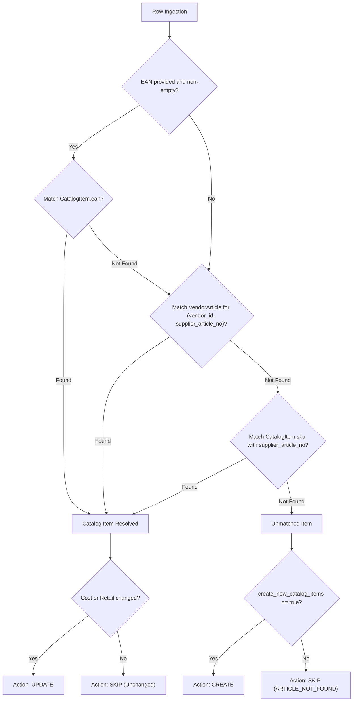

# Supplier Price List Import & Margin Rules

## Summary

> The Supplier Price List Import module enables automotive workshops to ingest high-volume supplier parts catalogs via CSV, match supplier items against the internal parts catalog, update purchasing cost prices, and calculate consumer retail prices automatically using configurable margin rules. It features dry-run validation, price jump safeguards (>20%), vendor article cross-referencing, psychological price rounding, and an append-only price history audit trail.

To guarantee financial integrity, catalog price updates apply forward to future sales and repair orders only. Historical documents (`InvoiceItem`, `SalesOrderItem`, `WorkshopTaskLineItem`) remain strictly immutable.

This capability was designed in collaboration with the pilot customer to streamline regular catalog updates from major parts distributors while eliminating manual price keying errors.

---

## User Stories

- As a **Parts Manager**, I want to **import a supplier price list CSV file with dry-run preview** so that **I can inspect price changes, resolve unmatched parts, and verify calculated retail prices before applying changes to the catalog.**
- As a **Shop Owner / Admin**, I want to **configure tiered margin rules by brand, revenue group, and purchase cost bracket** so that **selling prices are automatically calculated with consistent markups and psychological price points (`.90`, `.99`, whole euro).**
- As an **Inventory Clerk**, I want to **be alerted when a supplier price increases or decreases by more than 20%** so that **supplier typos or currency discrepancies are flagged and require explicit user confirmation before taking effect.**
- As a **Procurement Specialist**, I want to **link supplier article numbers to our catalog items** so that **future purchase orders and imports automatically match the supplier's catalog codes.**
- As an **Auditor / Finance Lead**, I want an **immutable audit log of all catalog cost and retail price revisions** so that **every price adjustment can be traced back to a specific supplier import job, timestamp, and user.**

---

## Database Architecture

### Core Tables & Models

| Table | Prisma Model | Purpose | Key Constraints / Notes |
|-------|--------------|---------|-------------------------|
| `vendor_articles` | `VendorArticle` | Cross-reference mapping between a supplier's article number and the internal `CatalogItem`. | Unique constraint on `[tenant_id, vendor_id, vendor_article_no]`. Indexed on `[tenant_id, catalog_item_id]`. |
| `margin_rules` | `MarginRule` | Tenant rules specifying markup percentages, RRP pass-through, and rounding strategies. | Indexed on `[tenant_id, priority]`. Evaluated in ascending priority order. |
| `catalog_price_histories` | `CatalogPriceHistory` | Append-only audit record tracking cost and retail changes per item and import job. | Indexed on `[tenant_id, catalog_item_id, createdAt]` and `[tenant_id, import_job_id]`. |
| `finance_settings` | `FinanceSettings` | Contains `price_jump_threshold_percent` (default: 20%). | Tenant singleton. Configurable percentage for jump detection. |
| `import_jobs` | `ImportJob` | Tracks import jobs for entity type `SUPPLIER_PRICE_LIST`. | Stores file hash, dry-run totals, options, and status (`DRY_RUN_DONE`, `APPLIED`, `FAILED`). |
| `import_job_rows` | `ImportJobRow` | Individual rows evaluated during dry run and apply. | Stores action (`UPDATE`, `CREATE`, `SKIP`, `ERROR`), normalized JSON, errors, and warnings. |

### Deletion Policy Impact

Governed by `docs/deletion-policy.md`:
- `VendorArticle`: **Conditional / Hard delete allowed**. Unlinking a vendor article removes the lookup link without mutating the `CatalogItem` or historical transactions.
- `MarginRule`: **Soft-disable preferred** (`is_active = false`). Hard delete allowed if no longer desired.
- `CatalogPriceHistory`: **No / Forbidden**. Immutable price audit trail; cannot be deleted through any API.
- `ImportJob` / `ImportJobRow`: Retained as import audit history; deletion blocked while referenced by price history.

---

## CSV File Format & Ingestion Pipeline

### Supported Encodings & Delimiters
- **Encodings**: UTF-8, UTF-8 with Byte Order Mark (BOM), and Windows-1252 (CP-1252 fallback for legacy ERP exports).
- **Delimiter Detection**: Automatic detection based on the header line, prioritizing semicolon (`;`, German automotive industry standard) and supporting comma (`,`).
- **CSV Injection Neutralization**: OWASP CSV formula sanitization prepends `'` to cells beginning with `=`, `+`, `-`, `@`, `\t`, or `\r`.
- **Limits**: Up to 10,000 rows and 10 MB per import file.

### German Number Parsing (`parseGermanNumber`)
Supplier CSVs from German-speaking markets frequently format numbers with decimal commas and thousand dots or spaces. The ingestion engine standardizes all numbers:
- `1.234,50` &rarr; `1234.50` (thousand dot, decimal comma)
- `1 234,50` &rarr; `1234.50` (space thousands separator)
- `1234,50` &rarr; `1234.50` (decimal comma)
- `12,5` &rarr; `12.50` (short decimal comma)
- `12.50` &rarr; `12.50` (standard decimal point)
- Invalid or non-positive values in required price columns yield a validation error (`INVALID_COST_PRICE`).

### Template Column Specification (`SUPPLIER_PRICE_LIST`)

| Key | German Header Label | Required | Data Type | Description |
|-----|---------------------|----------|-----------|-------------|
| `supplier_article_no` | `Lieferanten-Artikelnummer` | **Yes** | String | Supplier's unique product identifier. |
| `ean` | `EAN` | No | String | European Article Number (13 digits or standard barcode). |
| `description` | `Beschreibung` | **Yes** | String | Part name or descriptive text. |
| `brand` | `Marke` | No | String | Manufacturer or brand name. |
| `cost_price` | `Einkaufspreis` | **Yes** | Decimal | Net purchase cost (must be > 0). |
| `rrp` | `UVP` | No | Decimal | Supplier Recommended Retail Price (Unverbindliche Preisempfehlung). |
| `unit` | `Einheit` | No | String | Packing/usage unit (defaults to `pcs` if empty). |

Canonical CSV header:
```text
Lieferanten-Artikelnummer;EAN;Beschreibung;Marke;Einkaufspreis;UVP;Einheit
```

---

## Catalog Matching & Action Resolution

For each CSV row, the import engine determines whether an existing `CatalogItem` matches the supplier part using a strict 3-tier precedence hierarchy:



### Matching Order
1. **EAN (`ean`)**: Highest fidelity match. If the CSV row provides a non-empty EAN, it is matched against `CatalogItem.ean` within the tenant.
2. **Vendor Article Mapping (`vendor_article_no`)**: Secondary match. Looks up existing `VendorArticle` mappings for `(tenant_id, vendor_id, supplier_article_no)`.
3. **SKU (`sku`)**: Tertiary fallback. Matches `supplier_article_no` against `CatalogItem.sku` (case-insensitive).

### Duplicate Article Detection
If the same `supplier_article_no` appears multiple times within a single CSV file, the second and subsequent occurrences are marked as `ERROR` (`DUPLICATE_ARTICLE_NO_IN_FILE`) referencing the line number of the initial entry.

### Row Action Definitions
- **`UPDATE`**: An existing catalog item was matched, and either the purchase cost or the calculated retail price differs from current values by at least 0.005 EUR.
- **`SKIP` (Unchanged)**: An existing item was matched, but neither cost nor calculated retail price has changed. No database writes are made.
- **`CREATE`**: No existing item matched, and the user enabled the `create_new_catalog_items` option. A new `CatalogItem` and `VendorArticle` record will be created.
- **`SKIP` (Unmatched)**: No existing item matched, and `create_new_catalog_items` is disabled (default). The row is skipped with warning `ARTICLE_NOT_FOUND`.
- **`ERROR`**: Row missing mandatory fields (article number, description, or valid positive cost) or containing duplicate in-file keys.

---

## Margin Rules & Calculation Engine

The calculation engine (`retailFromCost`) calculates the retail price from cost and supplier RRP using tenant margin rules.

### Rule Hierarchy & Matching Precedence
Rules are evaluated in ascending order of `priority` (lowest integer first, e.g. `0`, `10`, `20`):
1. **Brand Scoping**: If `rule.brand_id` is set, it matches only items with that brand. If `null`, it acts as a brand wildcard.
2. **Revenue Group Scoping**: If `rule.revenue_group_id` is set, it matches only items in that revenue group. If `null`, it acts as a revenue group wildcard.
3. **Cost Range Brackets**: `cost_min` and `cost_max` define an inclusive cost range (`cost >= cost_min` and `cost <= cost_max`).
4. **Active Flag**: Inactive rules (`is_active = false`) are ignored.

The first rule satisfying all criteria is applied. If no rule matches:
- Existing items retain their current `retail_price`.
- Newly created items default to supplier `rrp` (if provided > 0), otherwise `cost_price`.

### Calculation Modes
- **Markup Mode**: Multiplies net cost by the markup percentage:
  $$\text{Retail}_{\text{raw}} = \text{Cost} \times \left(1 + \frac{\text{markup\_percent}}{100}\right)$$
- **Supplier RRP Mode (`use_supplier_rrp = true`)**: Uses the supplier's recommended retail price (`rrp`) directly as the retail base. If `rrp` is null or zero in the CSV row, the engine falls back to `markup_percent` calculation.

### Rounding Strategies (`MarginRoundingStrategy`)

| Strategy | Description | Example Inputs & Outputs |
|----------|-------------|--------------------------|
| `NONE` | Standard commercial rounding to 2 decimal places. | `12.344` &rarr; `12.34`<br>`12.345` &rarr; `12.35` |
| `ROUND_90` | Rounds up to the nearest `.90` ending. | `12.00` &rarr; `12.90`<br>`12.35` &rarr; `12.90`<br>`12.92` &rarr; `13.90` |
| `ROUND_99` | Rounds up to the nearest `.99` ending. | `12.00` &rarr; `12.99`<br>`12.35` &rarr; `12.99`<br>`13.01` &rarr; `13.99` |
| `WHOLE_EURO` | Rounds to the nearest integer euro (`.00`). | `12.35` &rarr; `12.00`<br>`12.50` &rarr; `13.00` |

---

## Price Jump Safeguard & Acceptance Requirement

To protect against inadvertent margin erosion or catastrophic pricing errors (e.g. decimal place shifts in supplier price feeds), the system enforces an automated threshold guard:

### Threshold Detection Formula
The threshold is defined by `FinanceSettings.price_jump_threshold_percent` (default **20.00%**, configurable per tenant):
$$\Delta_{\text{cost}}\% = \frac{|\text{Cost}_{\text{new}} - \text{Cost}_{\text{old}}|}{\text{Cost}_{\text{old}}} \times 100$$
$$\Delta_{\text{retail}}\% = \frac{|\text{Retail}_{\text{new}} - \text{Retail}_{\text{old}}|}{\text{Retail}_{\text{old}}} \times 100$$

If either $\Delta_{\text{cost}}\% > \text{threshold}$ or $\Delta_{\text{retail}}\% > \text{threshold}$, the row is flagged:
- In dry run: Marked with `price_jump_flagged = true` and warning `PRICE_JUMP_EXCEEDED`.
- Visual preview: Highlighted with an amber warning badge in the dry-run review table.

### Acceptance Enforcement
When applying an import job (`POST /api/imports/:id/apply`):
- If any flagged row is present, the apply operation is **blocked** (`400 Bad Request`, code `IMPORT_PRICE_JUMP_REQUIRES_ACCEPTANCE`).
- To proceed, the user must explicitly submit:
  - `accept_all_price_jumps: true` (bulk acceptance for the job), or
  - `accepted_row_numbers: [rowNo1, rowNo2, ...]` (individual row acceptance list covering all flagged rows).

---

## Atomic Apply & Immutability Guarantees

Applying a supplier price list job (`POST /api/imports/:id/apply`) is chunked, not all-or-nothing:

- **Chunked transactions**: rows are applied in chunks of 50. Each chunk runs in its own `prisma.$transaction` (30 s timeout), so a chunk either commits completely or not at all.
- **Row-by-row fallback**: if a chunk transaction fails, the chunk is rolled back and its rows are re-applied one at a time, each in its own transaction. Rows that are `SKIP` or `ERROR` in the dry run are counted once and never re-applied.
- **Row-level failures become `ERROR` rows**: a stale row plan (`IMPORT_ROW_STALE`, e.g. the catalog price changed after the preview) or a row-level database conflict (unique violation `P2002`, foreign key `P2003`, referenced record gone `P2025`) rolls back only that row. The row is stored as `ERROR` (`IMPORT_APPLY_FAILED` for database conflicts) and counted under `error`. The other rows continue.
- **Other failures fail the job**: connection loss, pool or transaction timeouts, and deadlocks are not converted into row errors. The apply stops, the job ends `FAILED` with the totals of the work already committed, and the error is returned to the caller.
- **Committed chunks are kept**: chunks that committed before a failure are not rolled back. A `FAILED` job can therefore be partially applied, and its `totals_json` reflects exactly what was written.
- **Job completion**: the transition to `APPLIED` (with `appliedAt` and `totals_json`) and the `AuditLog` entry (`import_job.applied`) are written in one transaction. The job ends `APPLIED` with its final counts, including `error` rows.
- **Not re-appliable**: an `APPLIED` job returns `409 IMPORT_JOB_ALREADY_APPLIED`, and a `FAILED` job returns `409 IMPORT_JOB_STALE`. A new dry run is required to import again.

Each applied row writes the following within its own transaction:

1. **Catalog Price Updates**:
   - When cost or retail price changed, updates `CatalogItem.cost_price` and `CatalogItem.retail_price`.
   - In that case, inserts a `CatalogPriceHistory` record containing `old_cost`, `new_cost`, `old_retail`, `new_retail`, and `import_job_id`.
2. **Vendor Article Mapping Upsert**:
   - Creates or updates `VendorArticle` for `(tenant_id, vendor_id, supplier_article_no)` with `catalog_item_id`, `last_cost`, and `last_rrp`.
3. **New Item Creation (if enabled)**:
   - Inserts `CatalogItem` with `sku = supplier_article_no`, `name = description`, `cost_price`, `retail_price`, `brand_id`, `unit`, `ean`.
   - Creates `VendorArticle` link and initial `CatalogPriceHistory` (`old_cost: null`, `old_retail: null`).

**Historical Document Immutability**: `InvoiceItem`, `SalesOrderItem`, and `WorkshopTaskLineItem` store their agreed `unit_price` as a fixed historical record. Changing the master `CatalogItem` price has **zero effect** on existing draft, confirmed, or finalized sales/service documents.

---

## API Endpoints & Role-Based Access Control

All endpoints require authentication and active tenant membership. Modifying margin rules or applying imports requires `OWNER` or `ADMIN` role (`TECH` receives `403 Forbidden`).

| Method | Endpoint | Description | RBAC |
|--------|----------|-------------|------|
| `POST` | `/api/imports/dry-run` | Upload CSV and generate dry-run preview for `SUPPLIER_PRICE_LIST`. | `OWNER`, `ADMIN` |
| `POST` | `/api/imports/:id/apply` | Apply dry-run job with price jump acceptance options. | `OWNER`, `ADMIN` |
| `GET` | `/api/imports/:id` | Get import job status, totals, and row results. | `OWNER`, `ADMIN` |
| `GET` | `/api/margin-rules` | List all margin rules for current tenant ordered by priority. | `OWNER`, `ADMIN` |
| `POST` | `/api/margin-rules` | Create a new margin rule. | `OWNER`, `ADMIN` |
| `PUT` | `/api/margin-rules/:id` | Update an existing margin rule. | `OWNER`, `ADMIN` |
| `DELETE` | `/api/margin-rules/:id` | Delete an unused margin rule. | `OWNER`, `ADMIN` |
| `GET` | `/api/margin-rules/threshold` | Retrieve current price jump threshold percentage. | `OWNER`, `ADMIN` |
| `PUT` | `/api/margin-rules/threshold` | Update price jump threshold percentage. | `OWNER`, `ADMIN` |
| `GET` | `/api/vendors/:id/articles` | List all mapped vendor articles with last cost and RRP. | All Tenant Members |

---

## User Interface & Experience

### 1. Settings &rarr; Margenregeln (`MarginRulesTab`)
- **Location**: `src/components/settings/MarginRulesTab.tsx` (accessible via Settings page for administrators).
- **Rule Table**: Displays rules sorted by priority, indicating criteria (Brand, Revenue Group, Cost Bracket), calculation mode (Markup % or Supplier UVP), rounding strategy, and active toggle.
- **Rule Editor Modal**: Dialog for creating and modifying rules with German labels ("Margenregel", "Marke", "Erlösgruppe", "Einkaufspreis von/bis", "Aufschlag (%)", "Hersteller-UVP verwenden", "Rundungsstrategie").
- **Price Jump Threshold Card**: Configures the safety threshold percentage (default 20%).

### 2. Data Import Wizard (`DataImportSettingsTab`)
- **Location**: `src/components/settings/data-import/DataImportSettingsTab.tsx`.
- **Entity Selection**: Select "Lieferanten-Preisliste" (`SUPPLIER_PRICE_LIST`).
- **Vendor Selection**: Searchable vendor combobox is mandatory before uploading.
- **Column Mapping**: Suggests default German headers (`Lieferanten-Artikelnummer`, `EAN`, `Beschreibung`, `Einkaufspreis`, `UVP`).
- **Dry-Run Review**:
  - Highlights rows with price jumps exceeding threshold with an amber warning badge.
  - Checkboxes allow accepting individual rows or clicking "Alle Preissprünge akzeptieren".
  - Toggle to enable "Neue Artikel im Katalog anlegen" (default disabled).
  - Shows clear count totals: Neu anlegen, Aktualisieren, Überspringen, Fehler.

### 3. Vendor Details Integration (`VendorDetail`)
- **Location**: `src/pages/vendors/VendorDetail.tsx`.
- **Header Action**: "+ Preisliste importieren" button in top-right header, opening the import wizard with the vendor pre-selected.
- **Articles Tab**: Displays all mapped articles (`Lieferantenartikel`) for the supplier, showing supplier article number, linked catalog item SKU and name, last cost price, and last RRP.

---

## Verification & Testing Coverage

- **Pure Engine Tests**: `apps/core-api/src/margin-rule/retail-from-cost.util.spec.ts` (100% coverage of rounding strategies, cost brackets, RRP fallback, and precedence order).
- **Number Parsing Tests**: `apps/core-api/src/import/number-parse.util.spec.ts` (German decimal commas, thousand separators, negative numbers, invalid inputs).
- **Import Logic Tests**: `apps/core-api/src/import/supplier-price-list-import.logic.spec.ts` (3-tier matching cascade, action determination, in-file duplicate detection, price jump warnings).
- **E2E Integration Suite**: `apps/core-api/test/supplier-price-list-import.e2e-spec.ts`:
  - 5,000-row CSV fixture benchmark completing dry run under 5 seconds.
  - Idempotency check: Re-running the exact same CSV yields 0 new price history records.
  - Price jump acceptance verification: Blocked without acceptance; succeeds with acceptance.
  - Historical immutability verification: Asserts that existing `InvoiceItem`, `SalesOrderItem`, and `WorkshopTaskLineItem` retain their old unit prices.
  - Multi-tenant isolation and RBAC checks (`TECH` gets 403, Tenant B cannot view Tenant A imports or vendor articles).

---

## Pilot Customer Note

The supplier price list import architecture was specified to solve real-world procurement workflows observed with the pilot customer. In accordance with platform governance, all test fixtures, automated tests, and documentation utilize synthetic supplier master data (e.g. "Autoteile Direktvertrieb GmbH") and strictly omit the pilot customer's real identity.
