# Pending Actions

Pending actions are simulated, policy-approved operations stored in the existing `AgentProposal` queue. REST and MCP submissions share the typed executor registry. A pending response means the business operation has not been applied.

## Supported actions

| Policy action key | MCP tool | Simulation and apply operation |
| --- | --- | --- |
| `workshop_order.create` | `draft_workshop_order` | Create a scheduled workshop order |
| `inventory.part_reserve` | `reserve_part` | Reserve available inventory for a task line |
| `inventory.part_release` | `release_reservation` | Release an open reservation |
| `workshop_order.propose_line` | `propose_line_item` | Add a part or labor line to a task |
| `workshop_order.add_line` | Existing REST proposal compatibility | Add a line using the legacy proposal payload |
| `customer.update` | Existing proposal compatibility | Update tenant-scoped customer fields |

Unknown action keys fail closed. Policy context is built by the executor from the authenticated tenant and active site; request payloads cannot select a tenant or policy tier.

## Queue and lifecycle

- Store the policy action key in `AgentProposal.action_type`, the original operation in `payload_json`, and the simulation result plus `would_change` list in `preview_json`.
- `created_by_agent` retains optional MCP provenance. The action log remains authoritative for actor and trace history.
- Successful application ends with `EXECUTED`; existing expiry, rejection, and failure states remain in use.
- Submission and every queue lookup/update include the active `tenant_id`.
- Simulation uses the rollback transaction and side-effect guard. Email, SMS, and GCS writes are not performed during preview.

## REST and MCP behavior

- `POST /api/agent-proposals/submit` accepts an action key and `payload_json`; it resolves the registry, evaluates current policy, simulates eligible `PROPOSE` actions, and stores the pending row.
- `POST /api/agent-proposals/:id/apply` re-evaluates policy and applies one action through the same executor.
- `POST /api/agent-proposals/batch-apply` accepts `{ "ids": ["..."] }`. Each ID is applied independently and the response contains an `applied` or `failed` result for each ID.
- The existing proposal list exposes pending MCP actions in Approvals.
- MCP `PROPOSE` results return `status: "needs_approval"`, `pending_action_id`, `would_change`, and the simulation summary. Agents should continue planning and must not claim the write is complete.
- `AUTO` MCP calls retain the existing execute path. Disabled and `HUMAN_ONLY` actions are refused.

## Authorization and apply safety

OWNER, ADMIN, and ADVISOR can review and apply proposals. SALES and TECH cannot apply them. A pending action is claimed with a tenant-scoped compare-and-set before execution. The operation and state transition run in the same transaction, so concurrent apply requests dispatch at most once. Batch results remain independent when one ID is invalid, expired, or already claimed.

Workshop-order creation stores its server-resolved submission site in the simulation context. Apply requires that same site to remain the caller's active authorized site, preventing a site switch from changing the simulated destination.

Paperclip and Cloudflare OS informed the design as patterns only. This implementation adds no external dependency and uses no copied code. Approvals multi-select remains a follow-up; the batch API is available now.

```mermaid
flowchart LR
  Submit[REST or MCP submit] --> Policy[Evaluate current policy]
  Policy -->|PROPOSE| Simulate[Run shared executor in rollback transaction]
  Simulate --> Queue[Store payload and preview in AgentProposal]
  Queue --> Continue[Return needs_approval and pending_action_id]
  Continue --> Apply[Supervisor applies one ID or a batch]
  Apply --> Recheck[Re-evaluate policy and tenant scope]
  Recheck --> Claim[CAS claim PENDING proposal]
  Claim --> Execute[Run shared executor in transaction]
  Execute --> Done[Mark EXECUTED and record audit trace]
```

