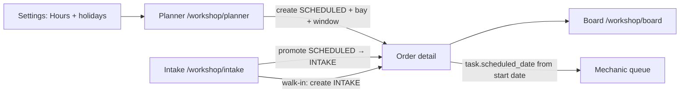

# Workshop Planner Calendar

## Summary

The Service Advisor needs a place to **set when this workshop is open**, **see which bay is free**, and **drop a new workshop order into that slot**.

ACP already has a kanban **Workshop Board** (`/workshop/board`, ADR-0018) for assigning cars that are on the floor. That board has no clock. `SCHEDULED` exists on the order state machine as "future appointment", but create always writes `INTAKE`, and there is no start/end time.

This module adds a **Workshop Planner** calendar at `/workshop/planner`. A booking is a `WorkshopOrder` with `status = SCHEDULED`, a bay, and a time window. Opening hours **and holidays** are tenant settings so a new workshop can define its week and closed days before the first job lands. Walk-in intake stays as it is; when the booked car arrives, intake **promotes** the scheduled order instead of minting a second `WO-` number.

**Out of scope (Phase 1):** customer self-booking, recurring *job* series, waitlist, labor-AW duration engine, mechanic-hour hard limits, merging planner into the kanban, school-holiday calendars, live third-party holiday lookups on every planner paint.

---

## Approaches considered

| Approach | What it is | Verdict |
|----------|------------|---------|
| **A. Time window on `WorkshopOrder`** | `scheduled_start_at` / `scheduled_end_at` + existing `bay_id`. Free spots = hours minus overlapping active orders. | **Chosen.** Reuses `SCHEDULED`. One document from booking to invoice. |
| **B. Separate `Appointment` entity** | CRM booking that converts to a workshop order at the door. | Rejected. Two lifecycles, conversion edge cases, numbering. Dummy odometer is cheaper than a second aggregate. |
| **C. Pre-generated slot rows** | `WorkshopSlot` per bay × day × 30 min; booking claims a row. | Rejected. Explodes with hours changes; a 90-minute job is N rows. |

Architecture detail lives in [ADR-0019](../../01-ADR/2026-08-21-workshop-planner-calendar.md).

---

## User Stories

- As a **Service Advisor**, I want to **set this workshop's opening hours and slot size** so that **the planner grid matches how we actually work**.
- As a **Service Advisor**, I want to **import this country's public holidays** so that **I do not type Nationalfeiertag by hand every year**.
- As a **Service Advisor**, I want to **see bays against a day or week clock** so that **I can tell which stall is free**.
- As a **Service Advisor**, I want to **click a free slot and create a workshop order there** so that **the booking holds the bay until the car arrives**.
- As a **Service Advisor**, I want **the same order to become INTAKE when the car arrives** so that **I do not create a duplicate job card**.
- As a **Service Advisor**, I want **the API to refuse two cars in the same bay at the same time** so that **the calendar cannot lie**.

---

## Relationship to existing workshop surfaces



| Surface | Question it answers |
|---------|---------------------|
| **Planner (new)** | When is a bay free, and book it. |
| **Intake** | The car is here. Claim the booking or start a walk-in. |
| **Board** | Who owns the stall right now. |
| **Orders** | Tasks, parts, job card, checkout. |
| **Mechanic queue** | What I do today (date-only `scheduled_date`). |

Do not put a time axis on the kanban. Do not hide `SCHEDULED` cards from the board in Phase 1 (they already appear in `GET /board/active`).

---

## Proposed product rulings

These are binding for implementation unless Product Owner overrides them in review.

1. **Grid by bay, not by mechanic.** A stall is the scarce physical resource for "is a spot free?". Mechanic is optional on the booking. Toggle "By Mechanic" is Phase 2.
2. **Day view default, week view in Phase 1.** Day is the advisor's booking surface. Week is for scanning load. Month is out of scope.
3. **Slot size 30 minutes, default job 60 minutes.** Start-cell click spans two slots. Advisor can change end time in the create sheet.
4. **Bay overlap = 409.** Mechanic overlap = amber warning, still allowed (ADR-0018 capacity ruling).
5. **Hours overflow = warning, not 422.** After-hours, Sunday, and **holiday** booking is a real shop move. The grid still shows the day as closed or shortened so it does not look free.
6. **Timezone `Europe/Vienna`** as tenant default. Store UTC timestamptz; render in `WorkshopSettings.timezone`.
7. **No `CANCELLED` status in Phase 1.** Delete is allowed on `SCHEDULED` only (no-show).
8. **Walk-in create unchanged.** Planner is an additional door, not a replacement for `+ Order` / Start Service.
9. **Odometer/fuel stay required `Int` columns.** Planner persists `0` until intake. Do not nullable-migrate a hot table for placeholders.
10. **Walk-ins still occupy the bay today.** `INTAKE` / `IN_PROGRESS` with a `bay_id` and no time window occupy that bay for the current local day so the planner cannot show a stall as free while a car is in it.
11. **Holidays override weekday hours.** A matching holiday wins over Mon–Sun. Closed holiday → empty grid with the holiday name. Short holiday (e.g. Christmas Eve) → grid uses that day's `openTime`/`closeTime`.
12. **Public-holiday import uses OpenHolidays API**, copied into `WorkshopHoliday`. Planner never calls the vendor at read time. Import nationwide `type=Public` for the tenant country (default `AT`) for the current and next calendar year. Easter-dependent days are stored as one-off dates, not `repeats_annually`. Manual rows (Betriebsurlaub) stay allowed. School holidays are not imported.

---

## Database Impact

### New Tables

#### `WorkshopSettings` (tenant singleton)

| Column | Type | Nullable | Default | Notes |
|--------|------|----------|---------|-------|
| `id` | `String @id @default(uuid())` | No | UUID | Primary key |
| `tenant_id` | `String` | No | — | Unique. Tenant-scoped singleton. |
| `timezone` | `String` | No | `"Europe/Vienna"` | IANA tz. |
| `slot_minutes` | `Int` | No | `30` | Grid quantum. Allowed values: 15, 30, 60. |
| `holiday_country_iso` | `String` | No | `"AT"` | ISO 3166-1 alpha-2 for OpenHolidays import. |
| `holiday_subdivision_code` | `String?` | Yes | — | Optional ISO 3166-2 (e.g. `DE-BY`). Null = nationwide only. |
| `createdAt` | `DateTime` | No | `now()` | |
| `updatedAt` | `DateTime` | No | `@updatedAt` | |

```prisma
model WorkshopSettings {
  id           String   @id @default(uuid())
  tenant_id    String
  tenant       Tenant   @relation(fields: [tenant_id], references: [id])
  timezone     String   @default("Europe/Vienna")
  slot_minutes Int      @default(30)
  holiday_country_iso        String  @default("AT")
  holiday_subdivision_code   String?
  openingHours WorkshopOpeningHour[]
  holidays     WorkshopHoliday[]
  createdAt    DateTime @default(now())
  updatedAt    DateTime @updatedAt

  @@unique([tenant_id])
  @@unique([tenant_id, id])
  @@index([tenant_id])
  @@map("workshop_settings")
}
```

Do **not** add these fields to `FinanceSettings`.

#### `WorkshopOpeningHour`

| Column | Type | Nullable | Default | Notes |
|--------|------|----------|---------|-------|
| `id` | `String @id @default(uuid())` | No | UUID | Primary key |
| `tenant_id` | `String` | No | — | Tenant isolation. |
| `workshop_settings_id` | `String` | No | — | Parent singleton. |
| `weekday` | `Int` | No | — | ISO weekday 1=Monday … 7=Sunday. |
| `is_closed` | `Boolean` | No | `false` | If true, `open_time`/`close_time` ignored. |
| `open_time` | `String` | No | `"07:30"` | `HH:mm` in tenant timezone. |
| `close_time` | `String` | No | `"17:00"` | `HH:mm` in tenant timezone. Must be > `open_time` when not closed. |

```prisma
model WorkshopOpeningHour {
  id                   String           @id @default(uuid())
  tenant_id            String
  tenant               Tenant           @relation(fields: [tenant_id], references: [id])
  workshop_settings_id String
  workshop_settings    WorkshopSettings @relation(fields: [tenant_id, workshop_settings_id], references: [tenant_id, id], onDelete: Cascade)
  weekday              Int
  is_closed            Boolean          @default(false)
  open_time            String           @default("07:30")
  close_time           String           @default("17:00")

  @@unique([tenant_id, id])
  @@unique([tenant_id, weekday])
  @@index([tenant_id])
  @@map("workshop_opening_hours")
}
```

Seed seven rows on settings upsert (same pattern as `FinanceSettings` create). Defaults:

| Weekday | Closed | Open | Close |
|---------|--------|------|-------|
| 1–5 Mon–Fri | No | 07:30 | 17:00 |
| 6 Saturday | No | 08:00 | 12:00 |
| 7 Sunday | Yes | 07:30 | 17:00 |

`open_time` / `close_time` are stored as `HH:mm` strings, not Postgres `time`, so Prisma stays simple and the values are wall-clock in `timezone`. Conversion to UTC instants happens in the planner service.

#### `WorkshopHoliday`

Date-specific override of weekday hours. Empty until the advisor imports public holidays or adds a manual row (Betriebsurlaub, Christmas Eve short day).

| Column | Type | Nullable | Default | Notes |
|--------|------|----------|---------|-------|
| `id` | `String @id @default(uuid())` | No | UUID | Primary key |
| `tenant_id` | `String` | No | — | Tenant isolation. |
| `workshop_settings_id` | `String` | No | — | Parent singleton. |
| `name` | `String` | No | — | Display label, e.g. `Nationalfeiertag`. |
| `observed_on` | `DateTime @db.Date` | No | — | Calendar date. For annual rows, month+day is what matches; year is ignored at query time. |
| `repeats_annually` | `Boolean` | No | `false` | If true, every year on the same month+day. **Imported public holidays are always `false`** (Easter moves). |
| `is_closed` | `Boolean` | No | `true` | All-day closed. If false, `open_time`/`close_time` are required and replace weekday hours. |
| `open_time` | `String?` | Yes | — | `HH:mm` when `is_closed = false`. |
| `close_time` | `String?` | Yes | — | `HH:mm` when `is_closed = false`. Must be > `open_time`. |
| `source` | `WorkshopHolidaySource` | No | `MANUAL` | `MANUAL` or `IMPORTED`. |
| `external_id` | `String?` | Yes | — | OpenHolidays holiday UUID when imported. |

```prisma
enum WorkshopHolidaySource {
  MANUAL
  IMPORTED
}

model WorkshopHoliday {
  id                   String                 @id @default(uuid())
  tenant_id            String
  tenant               Tenant                 @relation(fields: [tenant_id], references: [id])
  workshop_settings_id String
  workshop_settings    WorkshopSettings       @relation(fields: [tenant_id, workshop_settings_id], references: [tenant_id, id], onDelete: Cascade)
  name                 String
  observed_on          DateTime               @db.Date
  repeats_annually     Boolean                @default(false)
  is_closed            Boolean                @default(true)
  open_time            String?
  close_time           String?
  source               WorkshopHolidaySource  @default(MANUAL)
  external_id          String?

  @@unique([tenant_id, id])
  @@unique([tenant_id, observed_on])
  @@index([tenant_id])
  @@map("workshop_holidays")
}
```

**Matching a local calendar date `D`:**

1. One-off row with `repeats_annually = false` and `observed_on = D` wins.
2. Else an annual row whose month+day equals `D` (year ignored).
3. Else weekday `WorkshopOpeningHour`.

Reject create if another row would expand to the same date in any year (annual vs annual same month-day; annual vs one-off on that month-day). `observed_on` unique already blocks two one-offs on the same date. 29 February annual rows are skipped in non-leap years.

#### Public-holiday import (OpenHolidays API)

**Provider:** [OpenHolidays API](https://www.openholidaysapi.org/en/) (`https://openholidaysapi.org`). Open data, ODbL, no API key, hosted in Germany. Official OpenAPI at `https://openholidaysapi.org/swagger/v1/swagger.json`.

**Why not Nager.Date:** Nager covers 200+ countries, but ACP is DACH-first. Nager v4 names are English-only. Nager v3 AT 2026 mixes nationwide public days with Ostersonntag/Pfingstsonntag and regional school/patron days (`Josefstag`, `Leopolditag`). OpenHolidays AT 2026 returns the 13 nationwide public holidays with German names (`Nationalfeiertag`, `Christtag`) and `type=Public` only.

**Contract with the vendor (server-side only):**

```
GET https://openholidaysapi.org/PublicHolidays
  ?countryIsoCode={holiday_country_iso}
  &languageIsoCode=DE
  &validFrom={year}-01-01
  &validTo={year+1}-12-31
  &subdivisionCode={holiday_subdivision_code}   // omit when null
```

Timeout 3s. On failure, import returns `502` with a toast; planner reads stay on local rows.

**Keep / skip:**

| Keep | Skip |
|------|------|
| `type === "Public"` | `School` and other types |
| `nationwide === true`, or a subdivision row matching `holiday_subdivision_code` | Optional observances |
| Single-day `startDate === endDate` | Multi-day ranges (none expected for AT public days) |

**Copy, do not live-query.** Each kept row upserts a `WorkshopHoliday`:

- `name` = German `name[].text` where `language=DE`
- `observed_on` = `startDate`
- `repeats_annually = false`
- `is_closed = true`
- `source = IMPORTED`
- `external_id` = OpenHolidays `id`

Idempotent: skip (or refresh name on) an existing row with the same `observed_on`. Never overwrite a `MANUAL` row on that date — leave it, count as skipped. Re-import next year is how Easter Monday lands on the right day.

**Attribution:** ODbL. We store a per-tenant working copy for scheduling; we do not republish OpenHolidays as our own public API. Document the source in Settings copy: "Public holidays from OpenHolidays API."

Production egress must allow `openholidaysapi.org`.

### Modified Tables

| Table | Change | Migration Required? |
|-------|--------|---------------------|
| `WorkshopOrder` | Add nullable `scheduled_start_at DateTime?` | Yes — additive |
| `WorkshopOrder` | Add nullable `scheduled_end_at DateTime?` | Yes — additive |
| `Tenant` | Relation to `WorkshopSettings` / `WorkshopOpeningHour` / `WorkshopHoliday` | Yes |

```prisma
model WorkshopOrder {
  // ... existing fields ...
  scheduled_start_at DateTime?
  scheduled_end_at   DateTime?

  @@index([tenant_id, bay_id, scheduled_start_at], map: "idx_workshop_orders_bay_schedule")
}
```

Application invariant (enforced in service, not a DB check constraint in Phase 1):

- If either timestamp is set, both must be set and `scheduled_end_at > scheduled_start_at`.
- Planner create requires both plus `bay_id`.
- Walk-in `INTAKE` may leave both null.

### Deletion Policy Impact

Add to `docs/deletion-policy.md` at implementation time:

| Entity | Delete Allowed | Rule |
|--------|----------------|------|
| `WorkshopSettings` | No | Singleton configuration; update in place only. |
| `WorkshopOpeningHour` | No | Replaced by updating the seven weekday rows; never deleted independently. |
| `WorkshopHoliday` | Yes | Hard delete allowed. Not referenced by orders. Removing a holiday only changes future grid hours. |
| `WorkshopOrder` | Unchanged, with clarification | Hard delete allowed only while `SCHEDULED` (planner no-show). Blocked from `INTAKE` onward unless a future cancel API is added. |

---

## State Machine Impact

No new statuses. `SCHEDULED` becomes a real create target.

| From | To | Trigger |
|------|----|---------|
| *(new)* | `SCHEDULED` | Planner create (or `POST /orders` with schedule fields). |
| `SCHEDULED` | `INTAKE` | Intake Start Service / promote booking. Atomic `updateMany` guard (ADR-0011). |
| `SCHEDULED` | *(deleted)* | Advisor deletes booking. |
| `INTAKE` → … | existing | Unchanged. |

A `SCHEDULED` order cannot start mechanic execution. Mechanic queue already excludes parent status other than `INTAKE` / `IN_PROGRESS` (ADR-0014 §3.1). Keep that.

---

## API Contract Changes

### New Endpoints

| Method | Route | Request | Response | Auth |
|--------|-------|---------|----------|------|
| `GET` | `/api/workshop/settings` | — | `WorkshopSettingsResponse` | Tenant member (OWNER/ADMIN/SALES). TECH does not use this UI. |
| `PUT` | `/api/workshop/settings` | `UpdateWorkshopSettingsDto` | `WorkshopSettingsResponse` | OWNER/ADMIN |
| `GET` | `/api/workshop/holidays` | Optional `from`/`to` as `YYYY-MM-DD` (tenant calendar dates). Default: current local year. | `{ data: WorkshopHolidayDto[] }` | OWNER/ADMIN/SALES |
| `POST` | `/api/workshop/holidays` | `CreateWorkshopHolidayDto` | `WorkshopHolidayDto` | OWNER/ADMIN |
| `POST` | `/api/workshop/holidays/import` | `{ countryIsoCode?: string, subdivisionCode?: string \| null }` omitted fields use `WorkshopSettings` | `{ imported: number, skipped: number, yearFrom: number, yearTo: number }` | OWNER/ADMIN |
| `PATCH` | `/api/workshop/holidays/:id` | Partial holiday fields | `WorkshopHolidayDto` | OWNER/ADMIN |
| `DELETE` | `/api/workshop/holidays/:id` | — | `204` | OWNER/ADMIN |
| `GET` | `/api/workshop/planner` | Query: `from`, `to` (ISO instants), optional `bayId` | `PlannerGridResponse` | OWNER/ADMIN/SALES |

`from`/`to` are required and bounded: max range **8 days** (week view + timezone slop). Reject wider windows with `400`.

#### Settings shapes

```typescript
interface WorkshopOpeningHourDto {
  weekday: 1 | 2 | 3 | 4 | 5 | 6 | 7
  isClosed: boolean
  openTime: string  // HH:mm
  closeTime: string
}

interface WorkshopSettingsResponse {
  timezone: string
  slotMinutes: 15 | 30 | 60
  holidayCountryIso: string
  holidaySubdivisionCode: string | null
  openingHours: WorkshopOpeningHourDto[] // always length 7
}

interface UpdateWorkshopSettingsDto {
  timezone: string
  slotMinutes: 15 | 30 | 60
  holidayCountryIso: string
  holidaySubdivisionCode: string | null
  openingHours: WorkshopOpeningHourDto[]
}
```

`PUT` replaces all seven weekdays in one transaction. Reject if the array is not exactly weekdays 1–7. Validate IANA timezone against a server allowlist (Node `Intl` / `Intl.supportedValuesOf('timeZone')` where available). Holidays are **not** in this PUT — they have their own CRUD so a long holiday list does not ride on hours save.

```typescript
interface WorkshopHolidayDto {
  id: string
  name: string
  observedOn: string // YYYY-MM-DD
  repeatsAnnually: boolean
  isClosed: boolean
  openTime: string | null
  closeTime: string | null
  source: 'MANUAL' | 'IMPORTED'
}

interface CreateWorkshopHolidayDto {
  name: string
  observedOn: string
  repeatsAnnually?: boolean // default false
  isClosed?: boolean        // default true
  openTime?: string         // required when isClosed is false
  closeTime?: string
}
```

Holiday write validation: `isClosed = false` requires both times and `closeTime > openTime`. `409` if the date collides with another holiday after annual expansion. `GET /holidays` without range returns the current tenant-year plus the next year so the Hours tab can edit upcoming dates in one list.

#### Planner grid

```typescript
interface PlannerGridResponse {
  timezone: string
  slotMinutes: number
  range: { from: string; to: string }
  bays: Array<{ id: string; name: string; sortOrder: number }>
  openings: Array<{
    weekday: number
    isClosed: boolean
    openTime: string
    closeTime: string
  }>
  holidays: Array<{
    date: string // YYYY-MM-DD in tenant timezone, expanded into the requested range
    name: string
    isClosed: boolean
    openTime: string | null
    closeTime: string | null
  }>
  bookings: PlannerBooking[]
}

interface PlannerBooking {
  orderId: string
  orderNumber: string
  status: 'SCHEDULED' | 'INTAKE' | 'IN_PROGRESS'
  occupancyKind: 'BOOKING' | 'UNSCHEDULED_ON_FLOOR'
  bayId: string
  mechanicId: string | null
  mechanicName: string | null
  scheduledStartAt: string
  scheduledEndAt: string
  customer: { id: string; displayName: string } | null
  vehicle: { id: string; make: string; model: string; year: number; plate?: string }
}
```

**Query strategy (no N+1):**

1. `Promise.all`: active bays, settings+hours, holidays (one-offs in range + all annual rows), orders in range.
2. Orders filter: `tenant_id`, `status in (SCHEDULED, INTAKE, IN_PROGRESS)`, `bay_id` not null (and `bayId` if queried), and either:
   - timed: `scheduled_start_at < :to AND scheduled_end_at > :from`, or
   - unscheduled on-floor: timestamps null, status `INTAKE` or `IN_PROGRESS`, and the query range intersects **today** in the tenant timezone.
3. Include customer, vehicle, mechanic. Zero per-row awaits. For `UNSCHEDULED_ON_FLOOR`, the API synthesizes `scheduledStartAt`/`scheduledEndAt` as today's **effective** open→close (holiday override included). If today is fully closed, synthesize local midnight→next midnight so the stall cannot look free.

The frontend paints the grid from `openings` + `holidays` + `slotMinutes` and overlays `bookings`. For each local date, apply holiday override first (ruling 11), then weekday hours. The API does **not** return a cell matrix.

### Modified Endpoints

| Method | Route | Change |
|--------|-------|--------|
| `POST` | `/api/workshop/orders` | Optional `status`, `bayId`, `mechanicId`, `scheduledStartAt`, `scheduledEndAt`. `odometer`/`fuelLevel` optional when creating `SCHEDULED`. |
| `PATCH` | `/api/workshop/orders/:id` | May update schedule fields + `bayId` while `SCHEDULED` or `INTAKE`. Overlap check applies. |
| `POST` | `/api/workshop/orders` (walk-in) | Unchanged when schedule fields omitted: `INTAKE`, odometer/fuel required. |
| Intake Start Service | existing create/start path | **Promote** matching `SCHEDULED` order instead of insert (see below). |

#### Create DTO additions

```typescript
interface CreateWorkshopOrderDto {
  // existing: customerId, vehicleId, purpose, odometer, fuelLevel, reportedIssue, notes
  status?: 'SCHEDULED' | 'INTAKE'  // default INTAKE
  bayId?: string
  mechanicId?: string | null
  scheduledStartAt?: string // ISO
  scheduledEndAt?: string
}
```

Planner validation:

- `status === SCHEDULED` requires `bayId`, `scheduledStartAt`, `scheduledEndAt`.
- `odometer`/`fuelLevel` default to `0` when omitted on `SCHEDULED`.
- `INTAKE` still requires odometer/fuel as today.
- Mechanic, if set, must be active `role = MECHANIC`.
- Bay must be active.

Overlap (bay): inside the create/patch transaction, if any other occupying order on that bay has `[start, end)` overlapping — including an unscheduled on-floor job whose synthetic window is today open→close — throw `409 Conflict` with the colliding `orderNumber`.

### Intake promote (mandatory)

On Start Service / order create for a vehicle:

1. Look up `SCHEDULED` orders for `vehicle_id` in this tenant.
2. If one or more: choose `min(|scheduled_start_at - now|)`, then `updateMany` where `{ id, status: SCHEDULED }` → `INTAKE`, set odometer/fuel/issue. If `count === 0`, another request already promoted it → fall through to create **only if** no remaining `SCHEDULED`/`INTAKE`/`IN_PROGRESS` order exists for that vehicle; otherwise `409` with the live order id.
3. If none: create `INTAKE` as today.

Do not silently create a second active job for the same vehicle while one is `SCHEDULED`/`INTAKE`/`IN_PROGRESS`. Walk-ins for a different vehicle are unaffected.

### OpenAPI Regeneration

- [ ] `npm --prefix apps/core-api run openapi:generate`
- [ ] `npm --prefix apps/core-web run api:types:generate`

---

## UX Compliance

### Layout & Actions

- [ ] Page-level actions are **top-right**: date pager, Day/Week toggle, `+ Workshop Order`.
- [ ] Top-left: title **Workshop Planner**, subtitle in `text-slate-500` (selected date / week range).
- [ ] Header uses `text-2xl font-semibold tracking-tight`.
- [ ] Route `/workshop/planner`. Sidebar item after Workshop Board, Calendar icon (`lucide-react`).
- [ ] Settings tab **Hours** (or **Workshop hours**) in existing `SettingsPage.tsx`. Weekday save is a short form submit, not 750 ms autosave. Holidays on the same tab use a DataTable with `+ Holiday` (top-right of that section) and **Import public holidays**.

### Planner canvas (not a DataTable)

This is a grid, not a list page. DataTable rules do not apply to the canvas.

**Day view**

- Rows: active bays (`sort_order`, then name), same source as `GET /api/workshop/resources`.
- Columns: slots from that day's **effective** open→close (`holiday` override, else weekday) in `slot_minutes` steps.
- Closed weekday **or closed holiday**: empty state card. Weekday copy: "Workshop closed". Holiday copy: `Closed — {name}`. Both include `Go to Settings` (Hours tab). Still show any after-hours / on-floor bookings so rush jobs remain visible.
- Short holiday: grid spans only `openTime`–`closeTime`. Booking outside that window is the same outside-hours warning as ruling 5.
- Empty cell: click opens create **Sheet** (not centered dialog) prefilled with bay + start; end = start + 60 minutes (clamped to close time as a default only).
- Occupied block: spans duration; click opens existing order (navigate to `/workshop/orders/:id` or Sheet — prefer navigate for Phase 1, same as board card click today).
- Drag occupied `SCHEDULED` block to another cell: `PATCH` schedule + bay; rollback + toast on `409`.
- `INTAKE` / `IN_PROGRESS` blocks are visible but **not** draggable (car is already here; move via board/order detail).

**Week view**

- Columns: days in range. Rows: bays. Blocks show start time + plate/order number.
- Closed holiday columns use the same `Closed — {name}` treatment as day view (dimmed / empty, bookings still visible).
- Click empty region: same create Sheet with that day + bay; start defaults to **effective** opening time (holiday short hours if set).

**Create Sheet fields**

- Customer + vehicle: reuse intake search (VIN / plate / name). Quick Register still available.
- Bay (prefilled), start, end.
- Optional mechanic.
- Reported issue (optional).
- Primary action top-right of `SheetHeader`: `+ Workshop Order`.
- Outside-hours (including closed/short holiday) and mechanic-overlap: non-blocking `Alert`, submit still enabled.
- Bay overlap: disable submit if the client already sees a collision; server `409` is still the source of truth.

**Empty resources**

If no active bays: centered Card "No bays configured" + `Go to Settings` (Bays tab). Same pattern as the board empty state.

### Form Handling

- [ ] Hours settings: explicit Save (seven weekdays). Not autosave.
- [ ] Holiday create/edit: short form submit (`+ Holiday`). Inline name edit may use save-on-blur.
- [ ] Create booking: explicit submit on the Sheet.
- [ ] Reschedule drag: optimistic + rollback (board pattern).

### Real-Time Sync

- [ ] `WorkshopOrder` already in `SUPPORTED_ENTITY_TYPES`. Planner query keys must be invalidated from `dashboard-entity-map.ts` (`workshopKeys.planner(...)`).
- [ ] `WorkshopSettings` / `WorkshopOpeningHour` / `WorkshopHoliday`: **defer** WebSocket. Refetch when returning from Settings.

---

## Component Design

| Component | Location | Purpose |
|-----------|----------|---------|
| `WorkshopPlannerPage` | `apps/core-web/src/pages/workshop/WorkshopPlannerPage.tsx` | Route page: header, view toggle, grid. |
| `PlannerDayGrid` | `apps/core-web/src/components/workshop/planner/PlannerDayGrid.tsx` | Bay × slot canvas for one day. |
| `PlannerWeekGrid` | `apps/core-web/src/components/workshop/planner/PlannerWeekGrid.tsx` | Bay × day canvas for a week. |
| `PlannerBookingBlock` | `apps/core-web/src/components/workshop/planner/PlannerBookingBlock.tsx` | Occupied interval; StatusBadge; drag handle if SCHEDULED. |
| `PlannerCreateSheet` | `apps/core-web/src/components/workshop/planner/PlannerCreateSheet.tsx` | Sheet: customer/vehicle + times + bay. |
| `WorkshopHoursSettingsTab` | Settings tabs | Timezone, slot size, country for import, seven weekdays, holidays DataTable. |
| `WorkshopHolidayDialog` | Settings / Hours | Create/edit one holiday (date, name, annual, closed vs short hours). |

Query keys (extend `workshopKeys`, do not invent a second factory):

```typescript
planner: (from: string, to: string, bayId?: string) =>
  [...workshopKeys.all, 'planner', from, to, bayId ?? 'all'] as const,
settings: () => [...workshopKeys.all, 'settings'] as const,
holidays: (from?: string, to?: string) =>
  [...workshopKeys.all, 'holidays', from ?? 'year', to ?? 'year'] as const,
```

Reuse `@dnd-kit/core` already on the board. No new calendar library in Phase 1 (FullCalendar etc. are YAGNI and fight design-system rules).

---

## Inventory Impact

None. No stock reads or writes. Parts status stays a board concern.

---

## Fiscal Impact

None. No invoice, no `lock_date`, no numbering beyond the existing `WO-` sequence at create (same `FinanceSettings` increment as today).

---

## RBAC

| Role | Planner | Hours settings |
|------|---------|----------------|
| OWNER / ADMIN | Full | Full |
| SALES (Service Advisor login) | Full | Hours: read; write OWNER/ADMIN. Holidays: same (read, no write). |
| TECH | No (mechanic shell already blocks core app) | No |

SALES already uses the full sidebar (sign-in docs). Planner is an advisor tool; TECH never sees it.

---

## Testing Plan

### Backend E2E (`apps/core-api/test/`)

- [ ] Settings upsert seeds seven weekdays with documented defaults.
- [ ] `PUT /settings` rejects missing weekday, invalid `slotMinutes`, `close_time <= open_time` on an open day.
- [ ] Holiday CRUD: closed day, short day, annual repeat expands into next year on `GET /planner`.
- [ ] `POST /holidays/import` for AT current+next year inserts the 13 nationwide public days with German names, `source=IMPORTED`, `repeatsAnnually=false`.
- [ ] Re-import is idempotent (second call `imported=0` or only new years).
- [ ] Import does not overwrite a MANUAL row on the same date.
- [ ] Import `502` when OpenHolidays times out; existing holidays unchanged.
- [ ] Holiday create colliding with an existing one-off or annual month-day → 409.
- [ ] 29 Feb annual holiday is omitted from non-leap years on `GET /planner`.
- [ ] `GET /planner` on a closed holiday returns that date in `holidays` with `isClosed: true` and still returns after-hours bookings.
- [ ] `GET /planner` returns bookings that overlap the window, excludes `COMPLETED`/`INVOICED`, excludes null schedules.
- [ ] `GET /planner` with range > 8 days → 400.
- [ ] Create `SCHEDULED` with bay + window succeeds; walk-in without schedule still creates `INTAKE`.
- [ ] Second booking same bay overlapping window → 409 with colliding order number.
- [ ] Unscheduled `INTAKE` on a bay blocks a same-day timed booking on that bay → 409; next local day is allowed.
- [ ] Same-time different bays → 200.
- [ ] Mechanic double-book → 200.
- [ ] After-hours booking → 200 (including a closed holiday date).
- [ ] Reschedule `PATCH` into a taken slot → 409; into a free slot → 200.
- [ ] Start Service on a vehicle with one `SCHEDULED` order promotes it (same `order_number`, status `INTAKE`); does not increment workshop sequence a second time.
- [ ] Concurrent promote: second request 409 or lands on the already-INTAKE order, never two actives.
- [ ] Delete `SCHEDULED` → 204; delete `INTAKE` still blocked per current policy.

### Frontend

- [ ] Playwright: open planner, see bay rows, click empty slot, create booking, block appears.
- [ ] Collision: attempting a taken cell shows error toast; grid unchanged.
- [ ] Closed Sunday empty state + Settings link.
- [ ] Closed holiday empty state shows holiday name + Settings link.
- [ ] Short holiday grid uses holiday hours, not weekday hours.
- [ ] Hours tab: `+ Holiday` create, annual toggle, delete, **Import public holidays**.
- [ ] No bays empty state + Settings link.
- [ ] Day/Week toggle persists `localStorage` key `workshop-planner-view`.
- [ ] Hours tab save round-trips timezone and weekday hours.

---

## Implementation sequence (after spec approval)

Task-level plan: [2026-08-21-workshop-planner-calendar-implementation-plan.md](2026-08-21-workshop-planner-calendar-implementation-plan.md).

Do not start application code until Product Owner marks this spec **approved**, unless a follow-up explicitly continues implementation. Then execute the plan in this order:

1. Prisma models + migration + settings seed on first GET (weekdays empty of holidays).
2. Settings API + Hours settings tab (weekdays + holiday CRUD + OpenHolidays import).
3. Planner GET (occupancy query).
4. Create/patch schedule + bay overlap in a transaction.
5. Intake promote `SCHEDULED → INTAKE`.
6. OpenAPI + frontend types.
7. Planner page (day, then week) + create Sheet + drag reschedule.
8. Realtime invalidation map.
9. E2E tests.
10. Public Mintlify page `workflows/workshop-planner.mdx` + sidebar link. Rename language: Board vs Planner.

Each slice should be shippable without the next, except that the UI needs 1–4.

---

## Open Questions

Recorded as proposed rulings above. Confirm or override:

1. Bay-first grid vs mechanic-first (ruling: bay).
2. Hard bay 409 vs advisory (ruling: 409).
3. Delete `SCHEDULED` vs add `CANCELLED` (ruling: delete).
4. Default duration 60 vs 30 vs labor-AW (ruling: 60; labor-AW is Phase 2).
5. Duplicate active-order guard on the same vehicle (ruling: yes, block second active job).
6. Unscheduled on-floor occupancy for today (ruling: yes).
7. Holidays in Phase 1 (ruling: yes — tenant-owned list + OpenHolidays import, not Nager.Date).

---

## References

- [ADR-0019: Workshop Planner Calendar](../../01-ADR/2026-08-21-workshop-planner-calendar.md)
- [ADR-0018: Workshop Planner Kanban Board](../../01-ADR/2026-04-18-workshop-planner-kanban-board.md)
- [ADR-0014: Mechanic tablet](../../01-ADR/2026-04-27-mechanic-digital-repair-order-tablet-rbac.md)
- [ADR-0011: Atomic status guards](../../01-ADR/2026-04-12-atomic-status-transition-guards.md)
- [ADR-0006: Form auto-save](../../01-ADR/2026-04-12-form-auto-save-patterns.md)
- [Feature Spec: Workshop Board Resources](workshop-board-resources.md)
- [Feature Spec: Workshop Order Lifecycle](workshop-order-lifecycle.md)
- [OpenHolidays API](https://www.openholidaysapi.org/en/) — public-holiday import source
- [Nager.Date](https://date.nager.at/api) — considered; rejected for DACH naming and extra school/Sunday rows
- `apps/core-api/src/workshop/workshop-intake.service.ts` — create currently hard-codes `INTAKE`
- `apps/core-web/src/pages/workshop/WorkshopBoard.tsx` — spatial planner to keep separate
- `apps/core-web/src/components/navigation/AppSidebar.tsx`

---

## Linear Tracking

| Field | Value |
|-------|-------|
| Project | [Workshop Planner Calendar](https://linear.app/auto-core-platform/project/workshop-planner-calendar-9da198210de2) |
| Milestone | Spec review |
| Issues | [AUT-173](https://linear.app/auto-core-platform/issue/AUT-173) (approval), [AUT-174](https://linear.app/auto-core-platform/issue/AUT-174)–[AUT-178](https://linear.app/auto-core-platform/issue/AUT-178) (implementation, blocked) |
