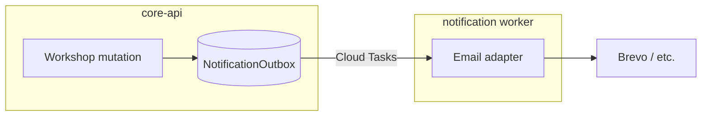

# Customer Communication & Approvals (Kostenvoranschlag)

## Summary

Epic 3 lets a service advisor create a **non-binding Kostenvoranschlag** from a `WorkshopOrder`, render a branded PDF, send a **transactional** email with an approval link, capture customer or advisor-recorded approval with audit evidence, warn on material overruns, and notify the customer when the vehicle is ready — without sending marketing messages (Epic 7 owns consent). Architecture is defined in [ADR-0025](../../01-ADR/2026-10-02-customer-communication-and-approvals.md). **No implementation** may ship until this spec, ADR-0025, and Dejan’s product-owner checkbox on [AUT-353](https://linear.app/auto-core-platform/issue/AUT-353) are satisfied. Customer-facing send (email/link) stays behind a **feature flag** until lawyer-approved copy and open legal items below are closed.

Research memos 02–05 informed the amended decisions ([AUT-360](https://linear.app/auto-core-platform/issue/AUT-360) amendments comment, 2026-10-02). **This document is not legal advice.**

---

## Product owner approval

Required before [AUT-354](https://linear.app/auto-core-platform/issue/AUT-354) and sibling Epic 3 code tickets start:

- [ ] **Approved by** _________________________ **(name)** on _________________________ **(date)**

---

## User Stories

- As a **service advisor**, I want to **create and send a Kostenvoranschlag from a workshop order** so that **the customer can approve work in writing before major spend**.
- As a **service advisor**, I want to **record a phone or in-person approval** so that **customers without email still have a documented decision**.
- As a **customer**, I want to **open a link, read the estimate, and approve or decline** so that **I do not need an ACP login**.
- As a **service advisor**, I want to **be warned when work exceeds the approved estimate** so that **I can inform the customer and issue a revised KV before invoicing**.
- As a **service advisor**, I want the **customer to receive a ready-for-pickup email** when the order reaches `COMPLETED` so that **pickup is coordinated without promotional content**.

---

## Decisions table

Sources: [AUT-360](https://linear.app/auto-core-platform/issue/AUT-360) (2026-10-02), **amended** by the “Amendments after legal research” comment where noted. Owner **Dejan** unless marked otherwise.

| ID  | Topic                        | Decision                                                                                                                                                                                                                                                                                                                                     | Owner           | Status                              |
| --- | ---------------------------- | -------------------------------------------------------------------------------------------------------------------------------------------------------------------------------------------------------------------------------------------------------------------------------------------------------------------------------------------- | --------------- | ----------------------------------- |
| D1  | PDF pipeline kind            | New kind **`Estimate`**; entity `WorkshopEstimateVersion`; amend ADR-0007 via ADR-0025; render once on send, never overwrite                                                                                                                                                                                                                 | Dejan           | Answered                            |
| D2  | Branding                     | Reuse ADR-0024 `DocumentBrandProfile` read-only; freeze at send; **no** `INVOICE_BRANDING_WRITER_ENABLED`; ADR-0024 addendum in ADR-0025                                                                                                                                                                                                     | Dejan           | Answered                            |
| D3  | Public approval route        | `GET/POST /api/public/estimate-approvals/:token`, UI `/approve/:token`; opaque token, hashed; **expiry = `valid_until` (14 days default)**; re-send = new token; GET repeatable, POST consumes; **no delivery webhooks v1**                                                                                                                  | Dejan           | Answered (amended: was 7-day token) |
| D4  | Consent owner                | Epic 7 ([AUT-374](https://linear.app/auto-core-platform/issue/AUT-374)) owns `CustomerConsent`; E3 sends **no marketing**; v1 uses `contact_email_ok` for transactional contact only                                                                                                                                                         | Dejan           | Answered                            |
| D5  | Binding / validity / overrun | **Non-binding** default; free; **14-day** validity (§ 862 ABGB acceptance period, not a statute); **mandatory B2C non-binding declaration** on PDF + approval page; **15 %** tenant-configurable guide (not statutory); **overrun_detected_at** / **overrun_notified_at** audit trail + advisor actions; invoice warning (hard block = open) | Dejan           | Answered (amended)                  |
| D6  | v1 document scope            | `WorkshopOrder` only; `KV-YYYY-XXXX` + version                                                                                                                                                                                                                                                                                               | Dejan           | Answered                            |
| D7  | Order vs estimate state      | **No** new order status; estimate states `DRAFT`→`SENT`→`APPROVED`\|`DECLINED`\|`EXPIRED`\|`SUPERSEDED`; approval **does not** auto-resume `WAITING_CUSTOMER` tasks                                                                                                                                                                          | Dejan           | Answered                            |
| D8  | ADR-0014                     | Stays **Proposed**; ADR-0025 supersedes **only** notification wording: `WAITING_CUSTOMER` → **internal advisor** notify, not customer email/SMS                                                                                                                                                                                              | Dejan           | Answered                            |
| D9  | Send / approve / snapshot    | Send + advisor-recorded approval: **OWNER/ADMIN/SALES**; TECH **403**; customer via link; snapshot = lines, labor, parts, tax, validity, seller entity, customer, vehicle, recipient email, branding, legal-text version; order changes after approval **do not** alter snapshot; stale approval **409**                                     | Dejan           | Answered                            |
| D10 | Customer contact             | Recipient = `Customer.email` at send (confirm dialog); no email blocks email send; advisor-recorded still allowed; phone/E.164 in AUT-372                                                                                                                                                                                                    | Dejan           | Answered                            |
| D11 | Providers                    | Email first, SMS later (AUT-372), WhatsApp out; EU-hosted + DPA; shortlist Brevo / Scaleway TEM / Mailjet / SES eu-central-1; default **Brevo** until AUT-362; per-message cost = AUT-362                                                                                                                                                    | Dejan / AUT-362 | Answered (DPA detail open)          |
| D12 | Ready event                  | `WORKSHOP_ORDER_READY` on `COMPLETED`; once per transition; resend audited                                                                                                                                                                                                                                                                   | Dejan           | Answered                            |
| D13 | Retention                    | **`retain_until`** = 31 Dec (document year + 7); legal hold; restricted access after erasure request; never-converted estimates 3y EOY (lawyer); IP/UA `approved_at + 3y`; outbox body 90d; **not** “bucket config only” (amends ADR-0007)                                                                                                   | Dejan           | Answered (amended)                  |
| D14 | Evidence package             | Version id, content hashes, token id, timestamps, IP, UA, legal text version, typed name + checkbox, confirmation email + provider ids; never “digital signature”                                                                                                                                                                            | Dejan           | Answered (added)                    |
| D15 | `intake_channel`             | `IN_PERSON` \| `REMOTE_ONLY` on order; FAGG distance-contract mode for B2C `REMOTE_ONLY`; flag-gated until lawyer                                                                                                                                                                                                                            | Dejan           | Answered (added)                    |
| D16 | Notification class           | Estimate / approval confirmation / ready = **transactional** if non-promotional (Art 6(1)(b)); Pickerl/review = **marketing** → Epic 7; checklist R1–R13 in AUT-357                                                                                                                                                                          | Dejan           | Answered (amended)                  |
| D17 | Hard block at invoice        | Prominent warning vs hard stop when overrun without notification/revision                                                                                                                                                                                                                                                                    | Dejan           | **Open** (product)                  |
| D18 | B2C overrun default %        | 15 % vs conservative 10 %                                                                                                                                                                                                                                                                                                                    | Lawyer          | **Open**                            |
| D19 | Lawyer copy                  | Non-binding declaration wording, button text, tolerance sentence                                                                                                                                                                                                                                                                             | Lawyer          | **Open**                            |
| D20 | FAGG scenario A              | Remote intake criteria; distance contract triggers                                                                                                                                                                                                                                                                                           | Lawyer          | **Open**                            |
| D21 | Werkvertrag timing           | Contract concluded at intake vs approval                                                                                                                                                                                                                                                                                                     | Lawyer          | **Open**                            |
| D22 | Evidence sufficiency         | Click approval vs written/phone                                                                                                                                                                                                                                                                                                              | Lawyer          | **Open**                            |
| D23 | Message classification       | Confirm transactional vs marketing for each template                                                                                                                                                                                                                                                                                         | Lawyer          | **Open**                            |
| D24 | DSGVO bases                  | Art 6(1)(b)/(f); IP/UA 3-year period                                                                                                                                                                                                                                                                                                         | Lawyer          | **Open**                            |
| D25 | AVV / vendors                | Tenant AVV, sub-processor register, SCC/TIA for US vendors                                                                                                                                                                                                                                                                                   | Dejan / AUT-362 | **Open**                            |
| D26 | Tracking pixels              | TKG § 165 Abs 3                                                                                                                                                                                                                                                                                                                              | Lawyer          | **Open**                            |
| D27 | Non-invoice retention        | Which documents fall under § 212 UGB / § 132 BAO                                                                                                                                                                                                                                                                                             | Steuerberater   | **Open**                            |
| D28 | Erasure model                | Tombstone/restriction after Art 17 request                                                                                                                                                                                                                                                                                                   | Lawyer          | **Open**                            |
| D29 | Backups                      | Retention vs erasure in backups                                                                                                                                                                                                                                                                                                              | Lawyer          | **Open**                            |

---

## Explicit rules (send, approve, snapshot, order changes)

### Who may send

- Roles: `OWNER`, `ADMIN`, `SALES` only. `TECH` (and mechanic tablet identities) receive **403** on send, resend, and advisor-recorded approval endpoints.
- Preconditions: authorized workshop order; estimate version in `DRAFT` to send; for **email** channel, recipient email required (from confirm dialog); `contact_email_ok` should be true when advisor records that the customer provided the address for order communication.
- **Feature flag:** `CUSTOMER_ESTIMATE_SEND_ENABLED` (name TBD in implementation) must be on for any real customer email/link send until legal sign-off.

### Who may approve

- **Customer:** valid token, POST with mandatory legal blocks and B2C declaration acceptance; records channel `LINK`.
- **Advisor:** `OWNER` / `ADMIN` / `SALES` records channel `ADVISOR_RECORDED` with method, note, and timestamp.
- Partial approval is **out of v1**; advisor creates a revised estimate version instead.

### What is snapshotted

At **send** (`DRAFT` → `SENT`), persist immutable JSON (and PDF bytes separately):

- All display lines (parts, labor), quantities, unit prices, discounts, tax breakdown, gross totals.
- `estimate_number`, `version`, `valid_from`, `valid_until`, legal-text version identifiers.
- Seller `LegalEntity` block (name, address, tax ids as shown).
- Customer name, address, vehicle registration/VIN as shown, **recipient_email**.
- Frozen branding snapshot per ADR-0025 §3.
- `content_sha256` of canonical snapshot.

### Order changes after approval

- Live `WorkshopOrder` / task / line edits **never** rewrite an approved or sent snapshot.
- If the order total exceeds approved total × (1 + tenant overrun threshold) or material new lines appear, surface overrun UI and require notification and/or revised estimate per D5.
- Customer attempts to approve a version that is no longer current (superseded or material order drift) → **409** with advisor guidance to send a new version.

---

## DSGVO and WKO Merkblatt (not legal advice)

Engineering follows the **WKO Merkblatt** guidance on customer data and marketing as a **product checklist**, not as legal counsel:

- **Separate purposes:** order-related messages (estimate, approval confirmation, ready notice) are processed for contract performance; **voluntary marketing** (newsletters, Pickerl reminders, review requests) requires its own legal basis and is **out of Epic 3**.
- **No OEM / third-party data sharing** without explicit customer consent (Epic 7 spec).
- **Processor role:** ACP acts as processor; workshop is controller — tenant AVV (Art 28), sub-processor list with change notice, DPAs with email/SMS vendors ([AUT-362](https://linear.app/auto-core-platform/issue/AUT-362), checklist R1–R13 on [AUT-357](https://linear.app/auto-core-platform/issue/AUT-357)).
- **Data minimization on public page:** token lookup returns only estimate projection fields required to decide.
- **Erasure vs retention:** honour `retain_until` and legal hold; after erasure request, **restrict access** until retention expires (Art 17(3)(b) DSGVO); delete or irreversibly anonymise thereafter (Art 5(1)(e)).
- **Transactional email** only without promotional banners, cross-sell, or “book next service” content; otherwise treat as marketing (consent / soft opt-in per Epic 7).

---

## Legal review (lawyer / Steuerberater)

Confirm before removing the customer-send feature flag:

1. Wording of the **non-binding declaration** and any tolerance sentence (KSchG § 5 Abs 2, § 1170a ABGB).
2. **15 % vs 10 %** default overrun guide and gross vs net measurement.
3. **Hard stop** at invoicing vs warning-only when overrun undocumented.
4. **FAGG** scenario A: `REMOTE_ONLY` criteria; distance-contract pack on approval page.
5. When the **Werkvertrag** is concluded (intake vs approval).
6. Whether the **evidence package** is sufficient for disputes.
7. Classification of **estimate / ready** templates as transactional vs marketing; Pickerl/review as marketing.
8. **Art 6(1)(b)/(f)** bases and **3-year** IP/UA retention.
9. **Tenant AVV**, vendor choice (SCC/DPF, transfer impact assessment).
10. **Tracking pixels** in email (TKG § 165 Abs 3).
11. Which **non-invoice documents** fall under § 212 UGB / § 132 BAO.
12. **Tombstone/restriction** model for erasure requests.
13. **Backups** vs deletion obligations.

---

## Database Impact

### Migration rule (mandatory)

- **Expand-only:** new tables, new nullable columns, new enum values with safe defaults only.
- Migrations deploy to **production before** application code that reads new columns (no staging environment).
- Backward compatible: previous app revision must keep running if deploy order is migration → API → web.

### New entities (conceptual — detail in implementation tickets)

| Entity                    | Purpose                                                                           |
| ------------------------- | --------------------------------------------------------------------------------- |
| `WorkshopEstimate`        | Header per workshop order (number `KV-YYYY-XXXX`, tenant scope)                   |
| `WorkshopEstimateVersion` | Versioned content, status, PDF fields, snapshot JSON, validity, branding snapshot |
| `EstimateApproval`        | Decision row (channel, evidence fields, advisor or link metadata)                 |
| `EstimateApprovalToken`   | Hashed token, `valid_until`, consumed_at                                          |
| `NotificationOutbox`      | Domain-event-driven send queue                                                    |
| `NotificationDeliveryLog` | Provider ids, metadata (bodies purged per D13)                                    |

### Modified entities

| Entity                              | Change                                                                                            |
| ----------------------------------- | ------------------------------------------------------------------------------------------------- |
| `WorkshopOrder`                     | `intake_channel` (`IN_PERSON` \| `REMOTE_ONLY`); optional overrun summary fields or derived views |
| `Customer`                          | `contact_email_ok` NOT NULL DEFAULT false (expand-only)                                           |
| `FinanceSettings` or sequence table | `KV` counter per year (ADR-0009)                                                                  |

### Deletion Policy Impact

Update `docs/deletion-policy.md` in implementation: estimate versions, approvals, tokens, and outbox rows are **not** hard-deletable when linked to retained documents; follow `retain_until` and legal hold.

---

## State machines

### Workshop order (unchanged v1)

`SCHEDULED` → `INTAKE` → `IN_PROGRESS` → `COMPLETED` → `INVOICED` (see [[workshop-order-lifecycle]]).

### Estimate version

`DRAFT` → `SENT` → `APPROVED` | `DECLINED` | `EXPIRED` | `SUPERSEDED`

- `SUPERSEDED` when a newer version is sent.
- `EXPIRED` when `valid_until` passes without decision (batch or on-access).

### Workshop task (unchanged)

`WAITING_CUSTOMER` remains task-level; approval does not auto-transition tasks.

---

## API Contract Changes (planned)

Implementation tickets must follow OpenAPI contract-first (ADR-0010). Expected surface:

| Method   | Route                                                | Purpose                              |
| -------- | ---------------------------------------------------- | ------------------------------------ |
| POST     | `/api/workshop/orders/:id/estimates`                 | Create draft                         |
| POST     | `/api/workshop/estimates/:versionId/send`            | Snapshot, PDF enqueue, token, outbox |
| POST     | `/api/workshop/estimates/:versionId/approve-advisor` | Advisor-recorded decision            |
| GET/POST | `/api/public/estimate-approvals/:token`              | Public view / decide                 |
| POST     | `/api/workshop/orders/:id/overrun/notify`            | Record customer informed             |
| POST     | `/api/notifications/outbox/replay`                   | Admin replay (guarded)               |

OpenAPI regeneration checklist applies when implemented.

---

## UX Compliance

- Workshop order detail: top-right **Send estimate**, **Record approval**, **Resume waiting tasks** in `ActionGroup`.
- Estimate status on order header as `StatusBadge` (sent / approved / declined / expired).
- Send dialog: confirm recipient email, validity, legal preview; block send if email missing (with advisor-recorded path visible).
- Overrun banner on order when threshold exceeded; actions **Kunden informiert** and **Send revised estimate**.
- Public `/approve/:token`: mobile-first, `noindex`, confirm step, mandatory legal blocks above primary button.
- Ready-for-pickup: advisor toggle/auto on `COMPLETED` per AUT-357; no marketing content.

---

## Notification architecture

- Separate queue from PDF worker (ADR-0007).
- Mutation handlers enqueue only; never call provider APIs directly.
- CI/UAT: no real sends except allowlisted recipients.

---

## Milestones and ticket breakdown

Aligned with [Austria Market Roadmap](https://linear.app/auto-core-platform/project/austria-market-roadmap) Epic 3 tickets.

| Milestone                | Goal                                                 | Linear issues                                                                                                                                   | Blocked by                                                                                  |
| ------------------------ | ---------------------------------------------------- | ----------------------------------------------------------------------------------------------------------------------------------------------- | ------------------------------------------------------------------------------------------- |
| **0 — Spec & ADR**       | This spec + ADR-0025 + PO approval                   | [AUT-353](https://linear.app/auto-core-platform/issue/AUT-353), [AUT-360](https://linear.app/auto-core-platform/issue/AUT-360) (decisions done) | PO checkbox                                                                                 |
| **1 — Estimate PDF**     | `WorkshopEstimateVersion`, KV numbering, branded PDF | [AUT-354](https://linear.app/auto-core-platform/issue/AUT-354)                                                                                  | AUT-353 approval                                                                            |
| **2 — Notification bus** | Outbox + transactional email sender                  | [AUT-356](https://linear.app/auto-core-platform/issue/AUT-356)                                                                                  | AUT-353; [AUT-362](https://linear.app/auto-core-platform/issue/AUT-362) for production send |
| **3 — Approval 355a**    | `EstimateApproval`, advisor-recorded, audit          | [AUT-355](https://linear.app/auto-core-platform/issue/AUT-355)                                                                                  | AUT-353; benefits from AUT-354 model                                                        |
| **4 — Public link 355b** | `/approve/:token`, evidence package                  | [AUT-373](https://linear.app/auto-core-platform/issue/AUT-373)                                                                                  | AUT-355a, AUT-356 (email), security review                                                  |
| **5 — Ready email 357a** | `WORKSHOP_ORDER_READY` email                         | [AUT-357](https://linear.app/auto-core-platform/issue/AUT-357)                                                                                  | AUT-356                                                                                     |
| **6 — SMS 357b**         | E.164, opt-out                                       | [AUT-372](https://linear.app/auto-core-platform/issue/AUT-372)                                                                                  | AUT-357a, [AUT-374](https://linear.app/auto-core-platform/issue/AUT-374) consent spec       |
| **Epic 7**               | Consent ledger, marketing                            | [AUT-374](https://linear.app/auto-core-platform/issue/AUT-374)                                                                                  | Spec first; blocks Epic 5 Pickerl campaigns                                                 |
| **Human**                | Providers/DNS/DPA; GCS retention                     | [AUT-362](https://linear.app/auto-core-platform/issue/AUT-362), [AUT-371](https://linear.app/auto-core-platform/issue/AUT-371)                  | Parallel                                                                                    |

**Release policy:** Nothing in this epic is released or deployed to production customers until PO approval on AUT-353 and legal gates for customer send are cleared.

---

## Testing Plan (when implemented)

### Backend E2E

- RBAC: TECH cannot send/approve.
- Token: GET idempotent, POST consumes, expiry at `valid_until`, re-send invalidates old token.
- Snapshot immutability and 409 on stale approval.
- Outbox enqueued in same transaction as state change.
- Overrun fields written to audit trail.

### Frontend

- Send dialog validation; public approval flow on mobile viewport.
- Invoice finalisation warning when overrun undocumented.

---

## References

- [ADR-0025](../../01-ADR/2026-10-02-customer-communication-and-approvals.md)
- [ADR-0007](../../01-ADR/2026-04-12-async-pdf-pipeline.md), [ADR-0009](../../01-ADR/2026-04-12-sequential-document-numbering.md), [ADR-0014](../../01-ADR/2026-04-27-mechanic-digital-repair-order-tablet-rbac.md), [ADR-0024](../../01-ADR/2026-09-27-legal-entity-document-branding.md)
- [[workshop-order-lifecycle]]
- [[document-branding-and-letterhead]]
- Linear Epic 3: [AUT-353](https://linear.app/auto-core-platform/issue/AUT-353) · [AUT-354](https://linear.app/auto-core-platform/issue/AUT-354) · [AUT-355](https://linear.app/auto-core-platform/issue/AUT-355) · [AUT-356](https://linear.app/auto-core-platform/issue/AUT-356) · [AUT-357](https://linear.app/auto-core-platform/issue/AUT-357) · [AUT-372](https://linear.app/auto-core-platform/issue/AUT-372) · [AUT-373](https://linear.app/auto-core-platform/issue/AUT-373) · [AUT-374](https://linear.app/auto-core-platform/issue/AUT-374)

---

## Linear Tracking

| Field     | Value                                                                                                                                 |
| --------- | ------------------------------------------------------------------------------------------------------------------------------------- |
| Project   | [Customer Communication & Approvals](https://linear.app/auto-core-platform/project/customer-communication-and-approvals-49b9200f083b) |
| Milestone | 0 — Spec & ADR                                                                                                                        |
| Issues    | AUT-353 (spec), AUT-354, AUT-355, AUT-356, AUT-357, AUT-372, AUT-373; AUT-374 (Epic 7); AUT-360, AUT-362, AUT-371 (human)             |
