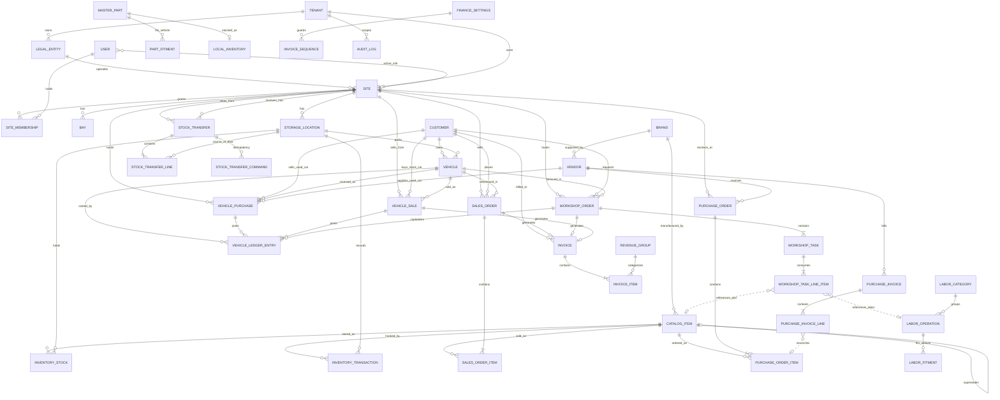

# Core Entity Relationship Diagram (ERD)

This ERD represents the high-level relationships between the major domains in the Auto Core Platform. It abstracts away join tables and audit fields for clarity. 

## Domain Legends

### Platform (ADR-0022)

- **`LegalEntity`**: Thin GmbH record (`name`, `country_iso` AT|DE). Future fiscal issuer. `Site.legal_entity_id` is immutable.
- **`Site`**: Physical shop. Owns bays, locations, planner hours/holidays (`workshop_holidays` unique `(tenant_id, site_id, observed_on)`), and site-owned documents. N:1 under `LegalEntity`.
- **`SiteMembership`**: Which users may activate a site. Not employee home-site. Authorization and transfer fan-out also require an active `TenantMember`.
- **`StockTransfer`**: Same-GmbH request → approve → ship → receive. Unique `(tenant_id, id)`. Lines copy `from_site_id`/`to_site_id`. Every transfer response (list/detail/create/actions/realtime) redacts `source_location_id` unless the caller has from-site membership. Cross-entity moves are not warehouse transfers.
- **`StockTransferCommand`**: Durable receive/return idempotency keyed by `(tenant_id, transfer_id, action, idempotency_key)`.

### CRM (Sales & Operations Front)
- **`Customer`**: The central actor requesting work or buying parts. Types: `PRIVATE` (individual) or `COMPANY`.
- **`Vehicle`**: The VIN master. `inventory_role = CUSTOMER` is a service/CRM car; `USED` (and later `NEW`/`DEMO`) is dealer stock (ADR-0016). CRM identity is tenant-wide; dealer-stock location/site/status fields require lot-site authorization. Nested order histories on customer/vehicle detail are site-scoped via authorized memberships. `GET /api/vehicle-stock/:id` is the active site only. Stock cars also link to `VehiclePurchase`, `VehicleSale`, and `VehicleLedgerEntry`. Parked dealer site is **lot-only** (`location.site_id`). `VehiclePurchase.vehicle_id` is not unique; do not resolve site from purchases. Receive requires a site-safe `vehicle_lot`. Same-site lot PATCH and cross-site `move-site` use `expectedLocationId` OCC. **`stock_status = ON_ORDER` is not persisted** on `Vehicle` (draft-purchase list DTO only). `VehicleLot` is `onDelete: Restrict`.

### Inventory & Catalog
- **`CatalogItem`**: The master product definition. Supports supersession chains (self-referencing relation) for replacement part tracking.
- **`InventoryStock`**: Per-location stock cache. `quantity_on_hand` is an eager cache derived from ledger entries — never mutated directly (ADR-0002).
- **`InventoryTransaction`**: Append-only ledger recording every stock movement. Types: `RECEIPT`, `SALE`, `ADJUSTMENT`, `TRANSFER_OUT`, `TRANSFER_IN`, `RETURN`, `WORKSHOP_CONSUMPTION` (ADR-0002).
- **`StorageLocation`**: Physical warehouse location. Each `InventoryStock` record ties a `CatalogItem` to a `StorageLocation`. Type `vehicle_lot` parks dealer-owned vehicles (not parts bins). Disable/soft-delete/hard-delete is blocked while a non-`SOLD` dealer vehicle references the lot.

### Procurement
- **`Vendor`**: External supplier. Linked to supported `Brand` entities.
- **`PurchaseOrder`** / **`PurchaseOrderItem`**: Re-stocking pipeline. Goods receipt creates `RECEIPT`-type ledger entries.
- **`PurchaseInvoice`** / **`PurchaseInvoiceLine`**: Vendor billing documents. Lines reconcile against `PurchaseOrderItem` records. Snapshot `unit_cost` and `item_name` at creation (ADR-0004).

### Vehicle Stock (ADR-0016)
- **`VehiclePurchase`**: Acquisition of a used VIN from a `Vendor` or a private `Customer`. Receive posts `VehicleLedgerEntry` type `PURCHASE` and sets `inventory_role = USED`. Not a parts `PurchaseOrder`.
- **`VehicleSale`**: Sale of a stock VIN to a buyer `Customer`. Finalize creates `Invoice` with `tax_mode = MARGIN_SCHEME` (phase A) and posts ledger `SALE`.
- **`VehicleLedgerEntry`**: Append-only vehicle cost/movement ledger (sibling of `InventoryTransaction`, not a parts `TransactionType`). Types: `PURCHASE`, `WORKSHOP_COST`, `ADJUSTMENT`, `SALE`.

### Workshop Operations
- **`WorkshopOrder`** / **`WorkshopTask`**: Service execution documents. Tasks have line items that reference either parts (`CatalogItem`) or labor (`LaborOperation`).
- **`LaborCategory`** / **`LaborOperation`**: Master labor data. Categories group operations for pricing and reporting (max depth 2).
- **`WorkshopTaskLineItem`**: Consumes parts (triggering `WORKSHOP_CONSUMPTION` inventory transactions) or references labor operations.

### Fitment Engine
- **`LaborFitment`**: Maps a `LaborOperation` to compatible vehicles (make, model, year range, engine code). Cascade-deleted with parent operation.
- **`MasterPart`**: Alternative parts catalog with supplier part numbers and OEM cross-references. Coexists with `CatalogItem`.
- **`PartFitment`**: Maps a `MasterPart` to compatible vehicles. Same structure as `LaborFitment`.
- **`LocalInventory`**: 1:1 with `MasterPart`. Tracks quantity, bin location, and pricing outside the ledger-based `InventoryStock` system.

### Finance
- **`Invoice`** / **`InvoiceItem`**: The immutable destination of all billable work. Generated from Sales Orders, Workshop Orders, or Vehicle Sales (ADR-0016). Items snapshot `revenue_group_name` and `unit_price` at the moment of finalization (ADR-0004). Vehicle sales also snapshot margin VAT via `tax_mode`.
- **`InvoiceSequence`**: Singleton counter guarding sequential invoice numbering (`RE-2026-XXXX`). Incremented atomically inside transactions.
- **`FinanceSettings`**: Singleton configuration entity. Holds `lock_date` (ADR-0003), numbering counters, and fiscal year settings.
- **`RevenueGroup`**: Revenue categorization for accounting exports. Linked to `InvoiceItem` via snapshotted `revenue_group_name`.

### Master Data
- **`Brand`**: Centralized master data for vehicle makes (`is_vehicle_make`) and part manufacturers (`is_part_manufacturer`). Linked to `Vendor` (supported brands) and `CatalogItem` (manufacturer).

### Audit & Compliance
- **`AuditLog`**: Append-only business audit ledger recording `before`, `after`, and `diff` snapshots for mutations (`UPDATE`, `DELETE`) on audited tenant business models. Captures actor metadata (`user_id`, `actor_email`, `actor_role`), request correlation ID (`request_id`), IP, and user-agent with deterministic secret redaction (ADR-0015). Never hard-deleted through ordinary application APIs.

---

## References

- ADR-0022: Site Is Request-Scoped Operational Ownership — `LegalEntity` / `Site` / `SiteMembership`; site rooms; same-GmbH `StockTransfer`
- ADR-0002: Ledger-Based Inventory — defines the `InventoryTransaction` taxonomy and eager cache model
- ADR-0003: Fiscal Lock Date — defines `FinanceSettings.lock_date` enforcement
- ADR-0004: Invoice Snapshotting — defines field-level snapshots on `InvoiceItem` and `PurchaseInvoiceLine`
- ADR-0005: Deletion Policy — defines per-entity deletion rules (`docs/deletion-policy.md`)
- ADR-0015: Audit Tracing and Operational Logging — defines the `AuditLog` ledger model, Prisma audit extension, and structured operational logging

