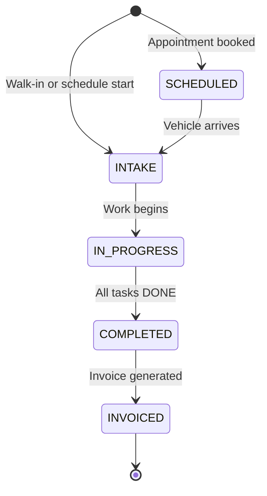
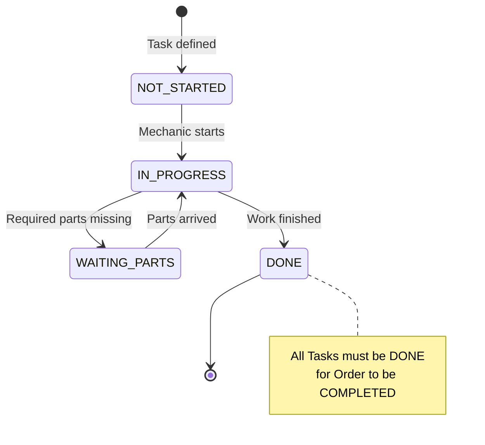
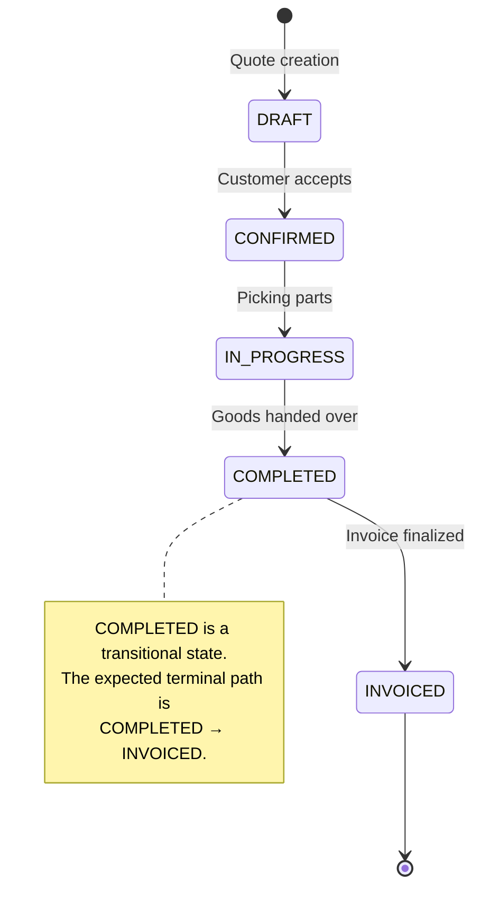
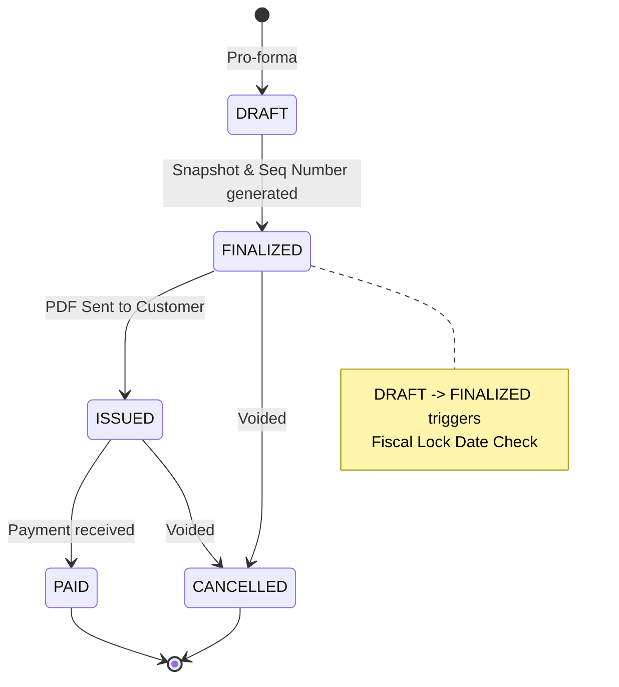
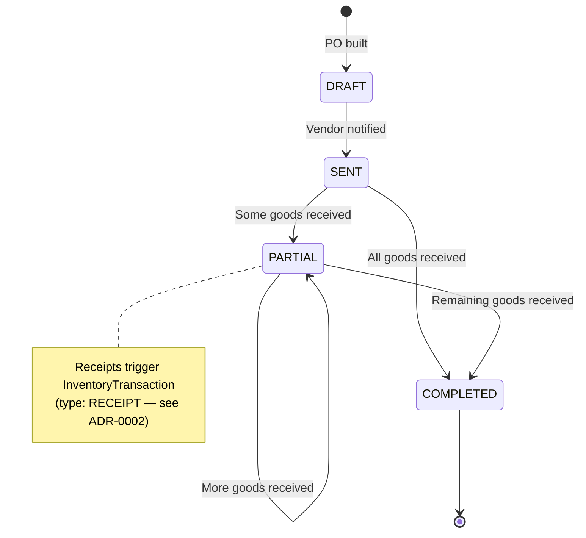
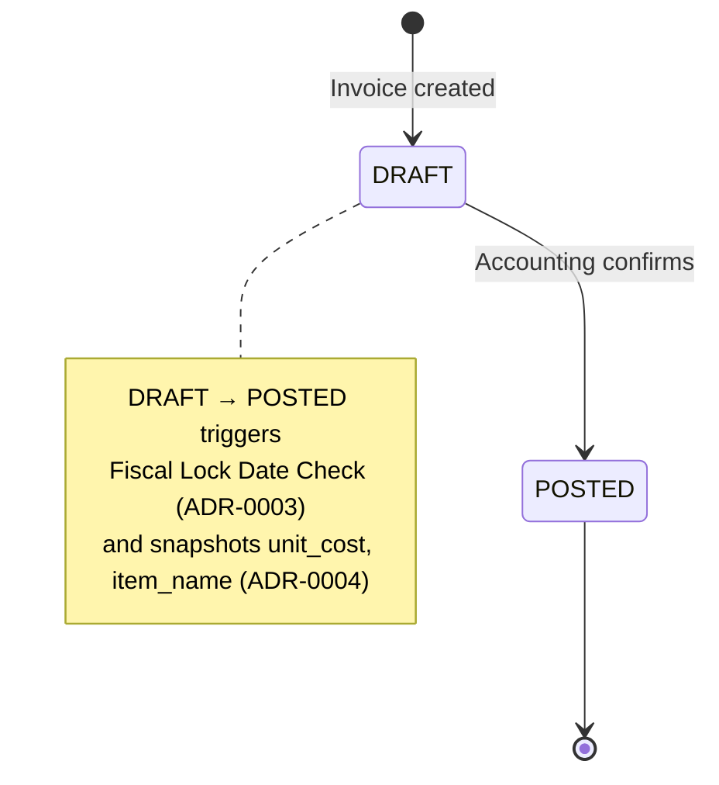

# Database State Machines

This document centrally maps the valid state transitions for the core workflow entities in Auto Core Platform. It guarantees that AI agents and human developers do not invent invalid status skips (e.g., from `DRAFT` straight to `COMPLETED`).

### Enforcement Mechanism

All status transitions are guarded using the **atomic `updateMany` pattern** inside `prisma.$transaction`:

```typescript
const result = await prisma.salesOrder.updateMany({
  where: { id: orderId, status: 'CONFIRMED' }, // guard: must be in expected state
  data:  { status: 'IN_PROGRESS' },
});
if (result.count === 0) {
  throw new ConflictException('Order was already transitioned by another request');
}
```

If the update matches 0 rows, the entity has already been moved by a concurrent request. This prevents race conditions without explicit row locks. See ADR-0011 (Atomic Status Transition Guards) for the full decision record and ADR-0006 (Form Auto-Save) for auto-save coordination.

## Workshop Order Workflow

The overarching document for a vehicle repair journey.



### Workshop Task Lifecycle
A sub-workflow operating inside the `WorkshopOrder`.



## Sales Workflow

The journey of selling parts to a customer.



## Invoice Lifecycle

The financial document workflow, shared by Sales and Workshop.



## Procurement (Purchase) Workflow

The vendor acquisition cycle.



## Purchase Invoice Lifecycle

The vendor billing document, created from one or more received Purchase Orders.



---

## Open Questions

1. **Cancellation for parent orders:** Should `SalesOrder` and `WorkshopOrder` support a `CANCELLED` state? Currently only `Invoice` has a cancellation path. If cancellation is needed, what are the preconditions (e.g., no linked invoices, no inventory consumed)?
2. **Partial payments:** Does the Invoice lifecycle need intermediate payment states (e.g., `PARTIALLY_PAID`) or is `PAID` always a single terminal event?

---

## References

- ADR-0002: Ledger-Based Inventory — defines `RECEIPT` and other `TransactionType` values triggered by state transitions
- ADR-0003: Fiscal Lock Date — `DRAFT → FINALIZED` (Invoice) and `DRAFT → POSTED` (PurchaseInvoice) must validate against `lock_date`
- ADR-0004: Invoice Snapshotting — defines which fields are snapshotted at which transition
- ADR-0006: Form Auto-Save — auto-save must be cancelled before status transition mutations
- ADR-0011: Atomic Status Transition Guards — defines the `updateMany` guard pattern documented in this file
- [[core-erd|Core ERD]] — entity relationships for all state machine entities
- Feature Specs: Workshop, Sales, Purchase specs define the business rules governing each workflow
