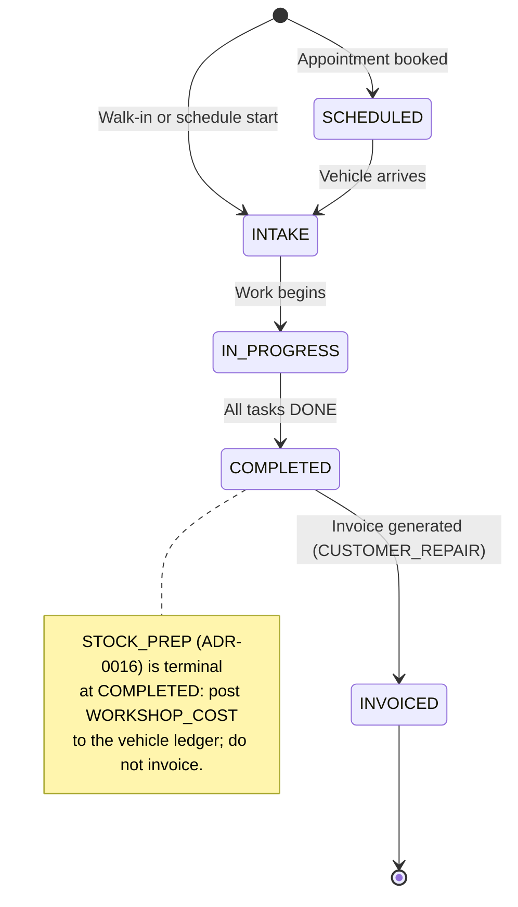
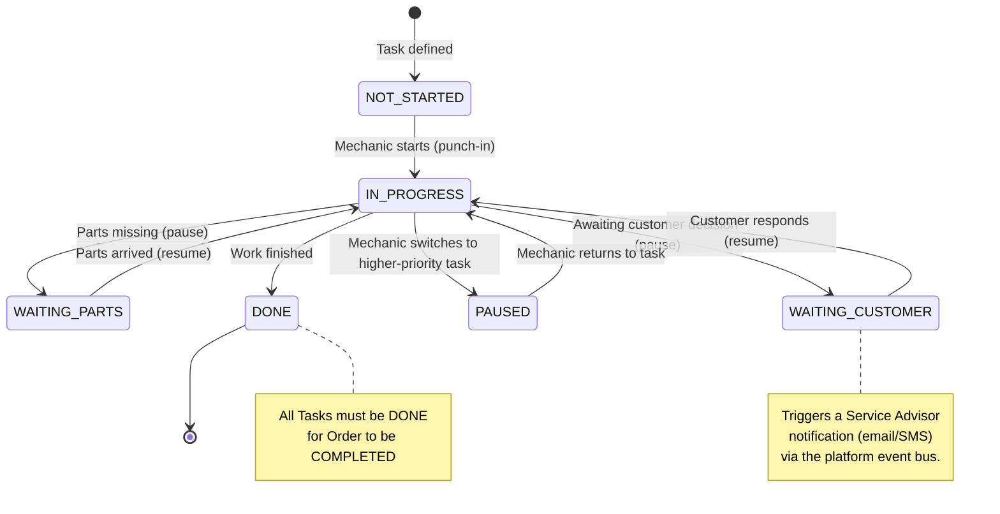
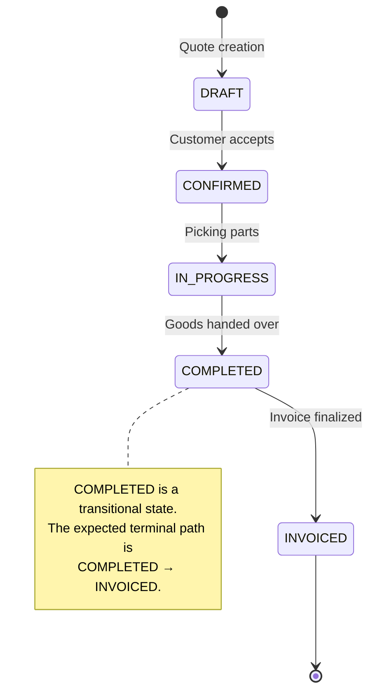
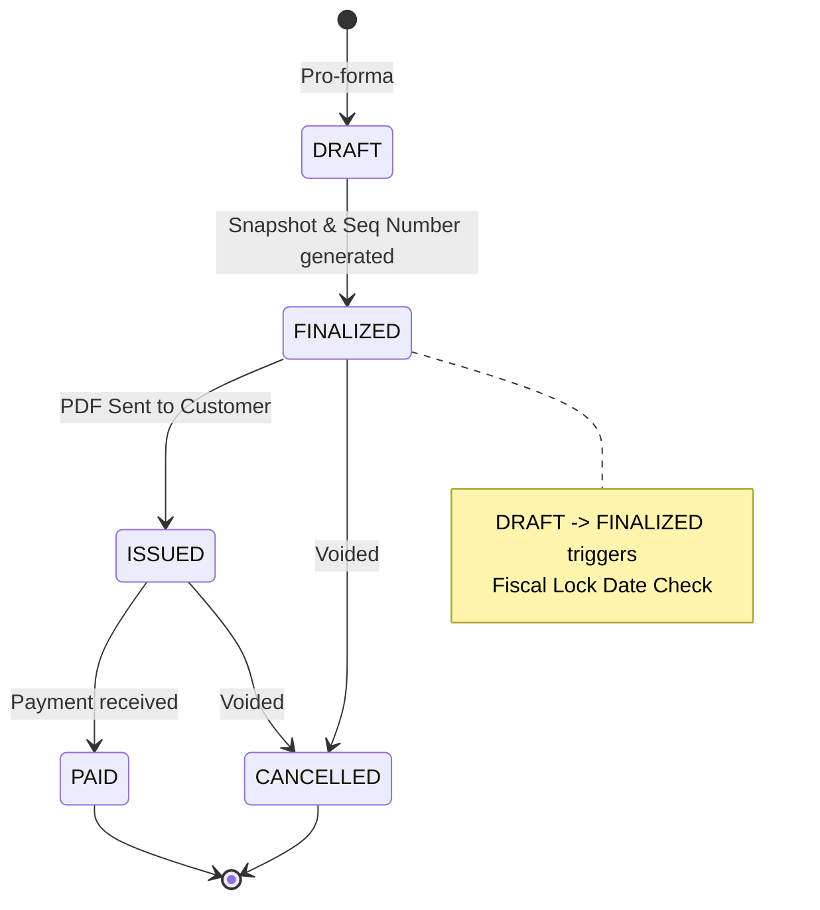
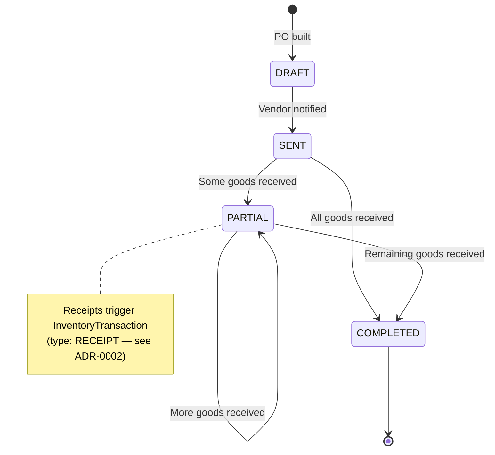
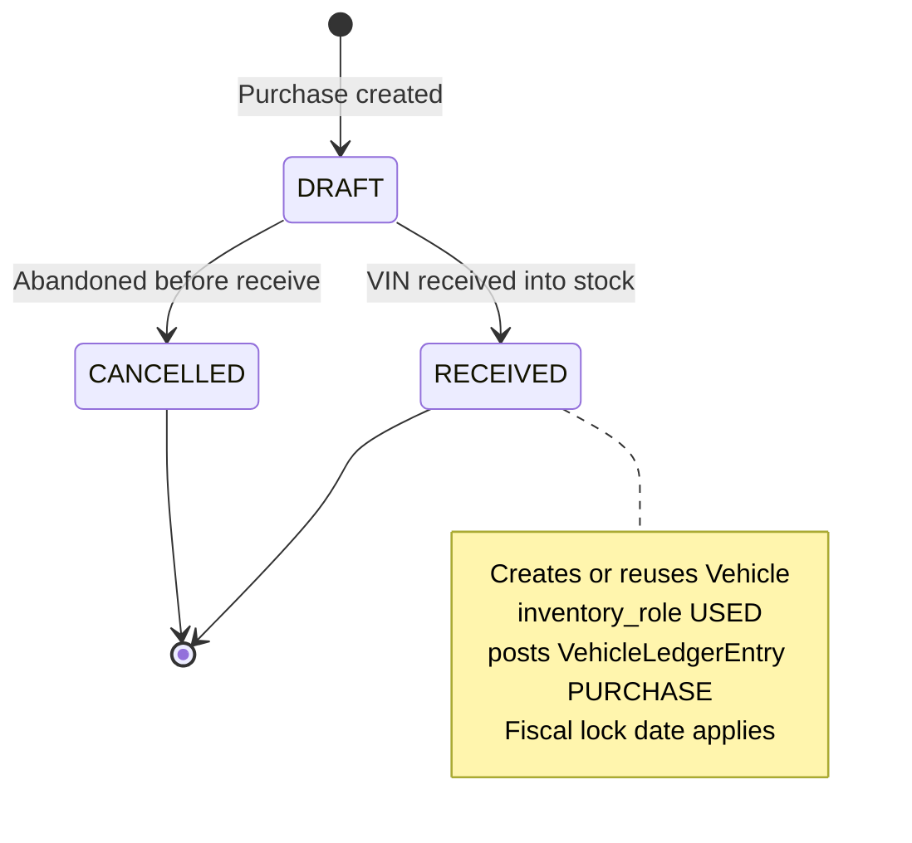
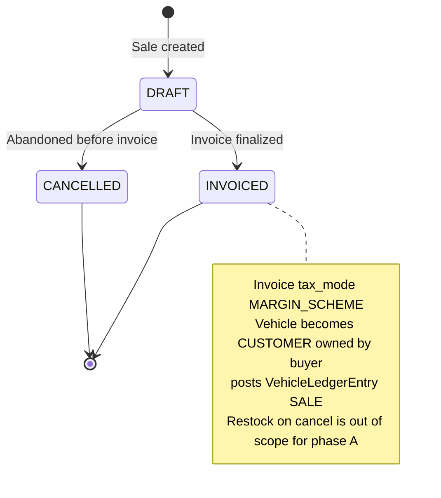
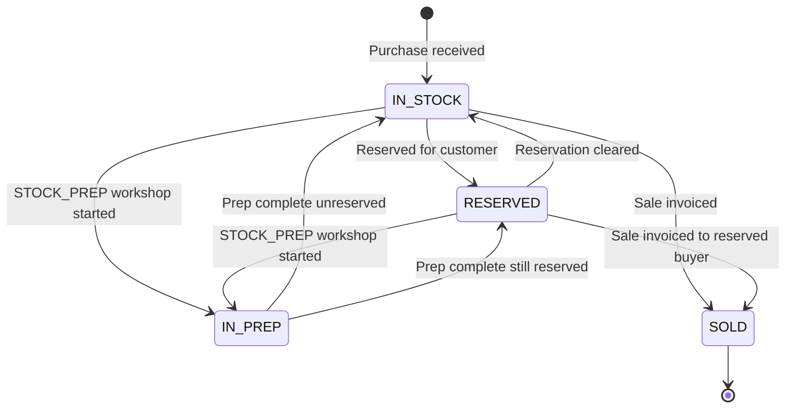
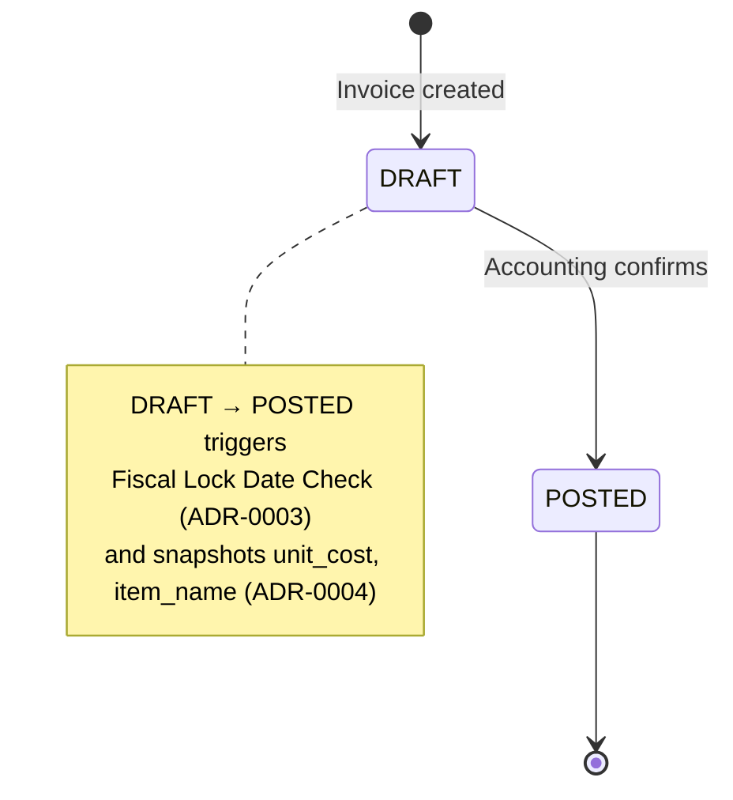

# Database State Machines

This document centrally maps the valid state transitions for the core workflow entities in Auto Core Platform. It guarantees that AI agents and human developers do not invent invalid status skips (e.g., from `DRAFT` straight to `COMPLETED`).

### Enforcement Mechanism

All status transitions are guarded using the **atomic `updateMany` pattern** inside `prisma.$transaction`:

```typescript
const result = await prisma.salesOrder.updateMany({
  where: { id: orderId, status: 'CONFIRMED' }, // guard: must be in expected state
  data:  { status: 'IN_PROGRESS' },
});
if (result.count === 0) {
  throw new ConflictException('Order was already transitioned by another request');
}
```

### Audit Observability

All workflow transitions on audited business models (`SalesOrder`, `WorkshopOrder`, `WorkshopTask`, `PurchaseOrder`, `PurchaseInvoice`, `Invoice`, etc.) are observed and recorded by the Prisma Audit Extension (ADR-0015).
- Whenever an atomic transition succeeds, an immutable `AuditLog` row is created with before/after status snapshots, the authenticated actor ID (`user_id`), email, role, and request correlation ID (`request_id`).
- When a transition guard fails (e.g. `updateMany` returns `{ count: 0 }`), zero rows are mutated and no phantom audit log is generated.

## Workshop Order Workflow

The overarching document for a vehicle repair journey.



### Workshop Task Lifecycle
A sub-workflow operating inside the `WorkshopOrder`.



#### Pause-Reason Mapping

When a mechanic pauses via the **Pause** or **Switch Task** flows, the `LaborEntry.pause_reason` and the resulting task status are set atomically according to this table:

| `LaborPauseReason`            | Resulting `WorkshopTaskStatus` |
|-------------------------------|-------------------------------|
| `WAITING_PARTS`               | `WAITING_PARTS`               |
| `WAITING_CUSTOMER`            | `WAITING_CUSTOMER`            |
| `SWITCHED_TO_HIGHER_PRIORITY` | `PAUSED`                      |
| `OTHER`                       | remains `IN_PROGRESS`         |
| `AUTO_SHIFT_CLOSE`            | no task status change (timer-only close) |

`AUTO_SHIFT_CLOSE` is set exclusively by the nightly scheduled job that force-closes orphaned `LaborEntry` records where `ended_at IS NULL`. It does not alter the task status so the job remains resumable the following shift.

## Sales Workflow

The journey of selling parts to a customer.



## Invoice Lifecycle

The financial document workflow, shared by Sales, Workshop, and Vehicle Sales (ADR-0016).



## Procurement (Purchase) Workflow

The vendor acquisition cycle.



## Vehicle Purchase (ADR-0016)

Used-vehicle acquisition. Not a parts `PurchaseOrder`.



## Vehicle Sale (ADR-0016)



## Vehicle Stock Status (USED cars)



After `SOLD`, `inventory_role` becomes `CUSTOMER` and `stock_status` is cleared.

## Purchase Invoice Lifecycle

The vendor billing document, created from one or more received Purchase Orders.



---

## Open Questions

1. **Cancellation for parent orders:** Should `SalesOrder` and `WorkshopOrder` support a `CANCELLED` state? Currently only `Invoice` has a cancellation path. If cancellation is needed, what are the preconditions (e.g., no linked invoices, no inventory consumed)?
2. **Partial payments:** Does the Invoice lifecycle need intermediate payment states (e.g., `PARTIALLY_PAID`) or is `PAID` always a single terminal event?

---

## References

- ADR-0016: Vehicle Stock — `VehiclePurchase`, `VehicleSale`, and `USED` `stock_status` machines; `STOCK_PREP` workshop does not invoice
- ADR-0002: Ledger-Based Inventory — defines `RECEIPT` and other `TransactionType` values triggered by state transitions
- ADR-0003: Fiscal Lock Date — `DRAFT → FINALIZED` (Invoice) and `DRAFT → POSTED` (PurchaseInvoice) must validate against `lock_date`
- ADR-0004: Invoice Snapshotting — defines which fields are snapshotted at which transition
- ADR-0006: Form Auto-Save — auto-save must be cancelled before status transition mutations
- ADR-0011: Atomic Status Transition Guards — defines the `updateMany` guard pattern documented in this file
- ADR-0015: Audit Tracing and Operational Logging — defines audit capture for workflow state transitions
- [[core-erd|Core ERD]] — entity relationships for all state machine entities
- Feature Specs: Workshop, Sales, Purchase specs define the business rules governing each workflow

