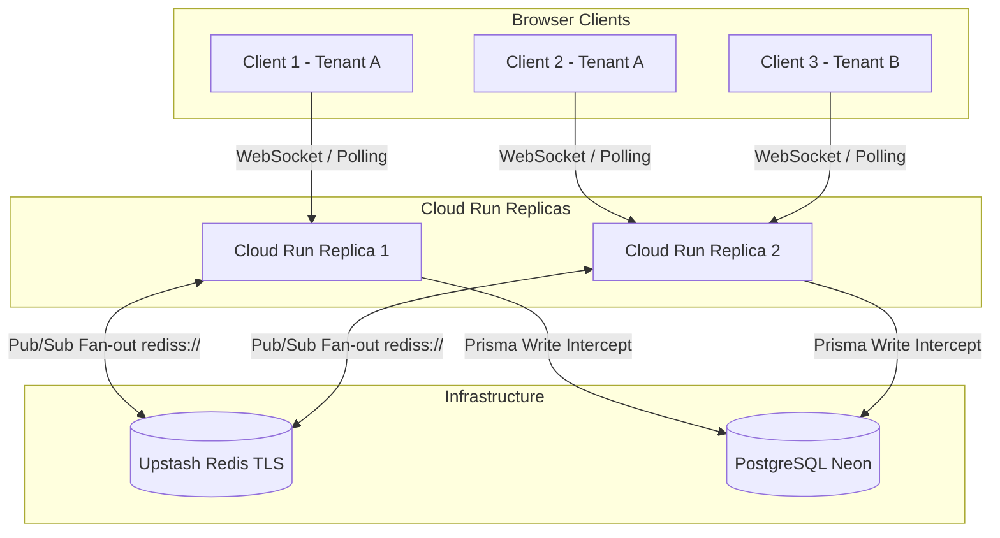

# Socket.IO Realtime & Multi-Instance Redis Scaling Runbook

This runbook guides operators, platform administrators, and engineers on configuring, running, and scaling Socket.IO realtime communication across Cloud Run instances in Auto Core Platform.

---

## 1. Architecture Overview

Auto Core Platform uses Socket.IO (`/dashboard-realtime` namespace with path `/api/socket.io`) to stream mutations (`entity_updated` events and `auth:claims_updated` events) to connected frontend clients in real time.

Production Redis is **Upstash** (public TLS `rediss://`). Cloud Run reaches it over the internet. There is **no VPC connector and no Memorystore**.



### Cloud Run WebSocket Requirements

Cloud Run manages serverless HTTP/WebSocket containers. Without explicit flags, idle WebSockets are dropped when CPU is throttled between HTTP requests, and instances scale to zero.

These flags apply **only to `core-api`**, not `core-api-pdf-worker`:

- **`--min-instances 1`**: Prevents cold starts and keeps at least one instance alive to maintain long-lived WebSocket connections.
- **`--no-cpu-throttling`**: Allocates CPU continuously outside active requests so background WebSocket ping/pong heartbeats are never starved.
- **`--max-instances 5`**: Horizontal scale-out. Safe because `REDIS_URL` is injected and the Socket.IO Redis adapter fans room broadcasts across replicas.

Do not copy the Socket.IO always-on CPU flags onto the Playwright PDF worker.

### Redis Pub/Sub Adapter

When `REDIS_URL` is set, `DashboardGateway` creates pub/sub Redis clients and attaches `@socket.io/redis-adapter` so room broadcasts (`tenant_{tenantId}`, `user_{userId}`) fan out across all replicas.

If `REDIS_URL` is unset, `DashboardGateway` falls back to the in-memory adapter (local development and e2e testing). In-memory mode must not run with `--max-instances > 1` in production: a mutation on replica A would not notify sockets on replica B.

---

## 2. Production Redis: Upstash (current)

Production uses Upstash Redis on the free tier as a public TLS endpoint. Do **not** add a Serverless VPC Access connector or Direct VPC egress for this path. Do **not** provision Memorystore unless the team later leaves Upstash for a private GCP Redis.

### Why not Memorystore / VPC

Memorystore uses private RFC 1918 addresses, so Cloud Run would need VPC egress. That is extra GCP cost. Upstash is reachable as `rediss://` from Cloud Run without VPC. Stay on Upstash until the command quota is a real problem; then pay Upstash, not Memorystore, unless there is a separate reason to keep Redis inside GCP.

### Free-tier limits

Upstash free tier is capped (currently **500,000 commands per month**). Socket.IO Redis adapter uses pub/sub plus connection overhead. Prefer an Upstash region close to Cloud Run (`europe-west3`). Watch the Upstash console for command volume. If the quota binds, upgrade the Upstash plan rather than adding GCP VPC + Memorystore by default.

### Step 2.1: Store `REDIS_URL` in Google Secret Manager

The GSM secret name must be exactly `REDIS_URL`. Value is the Upstash TLS URL, for example `rediss://default:<TOKEN>@<HOST>.upstash.io:6379`.

```bash
echo -n "rediss://default:<TOKEN>@<HOST>.upstash.io:6379" | \
  gcloud secrets versions add REDIS_URL \
    --data-file=- \
    --project=auto-core-platform
```

If the secret does not exist yet:

```bash
echo -n "rediss://default:<TOKEN>@<HOST>.upstash.io:6379" | \
  gcloud secrets create REDIS_URL \
    --data-file=- \
    --project=auto-core-platform
```

Grant the Cloud Run service account access:

```bash
gcloud secrets add-iam-policy-binding REDIS_URL \
  --member="serviceAccount:<SERVICE_ACCOUNT>@auto-core-platform.iam.gserviceaccount.com" \
  --role="roles/secretmanager.secretAccessor" \
  --project=auto-core-platform
```

`cloudbuild.yaml` already maps `--set-secrets …,REDIS_URL=REDIS_URL:latest` on `core-api` only.

---

## 3. Cloud Run scale-out (already wired)

`deploy-cloud-run` for `core-api` includes:

- `REDIS_URL=REDIS_URL:latest`
- `--min-instances 1`
- `--no-cpu-throttling`
- `--max-instances 5`
- no `--vpc-connector` / Direct VPC flags

PDF worker deploy stays `--min-instances 0 --max-instances 2` without `REDIS_URL`.

---

## 4. Verification & Diagnostics

### Handshake auth vs Redis connect

Nest does not await `afterInit`. JWT handshake middleware is registered **synchronously first**. Redis connect runs in the background and is **awaited on `onApplicationBootstrap`**, which Nest does await during `init()` (before `listen()`).

Connect is bounded by `REDIS_CONNECT_TIMEOUT_MS` (10s) so ioredis retry cannot hang boot forever.

### Eager connection & fail-closed safety

When `core-api` boots with `REDIS_URL` set:

1. `DashboardGateway` eagerly connects `pubClient` and `subClient` before attaching the adapter.
2. The success log is emitted only after both clients connect:

   ```
   [DashboardGateway] Attached Redis adapter to Socket.IO for cross-instance fan-out.
   ```

3. **Fail-closed in production**: In `NODE_ENV=production`, if `REDIS_URL` is set but connect fails or times out, `onApplicationBootstrap` throws a `CRITICAL` error. Nest `init()` fails and Cloud Run does not serve traffic on a split-brain in-memory adapter.
4. If a connection drops post-startup, client errors are logged:

   ```
   [DashboardGateway] Redis pub client error: …
   ```

### Multi-instance realtime verification

1. Connect Browser Client A to Replica 1 and Browser Client B to Replica 2 (both logged into Tenant A).
2. Perform a mutation on Client A (e.g. update a customer or workshop order).
3. Verify that Client B receives `entity_updated` immediately and invalidates the corresponding TanStack Query cache.

---

## 5. Local Development & E2E Testing

For local development and automated e2e test runs:

- Leave `REDIS_URL` unset in `.env` / test environment.
- Socket.IO runs in in-memory mode without Upstash or Docker Redis.
- To test multi-replica fan-out locally, run Redis (`docker run -p 6379:6379 redis:7`) and set `REDIS_URL=redis://localhost:6379`, or point at an Upstash `rediss://` URL.
