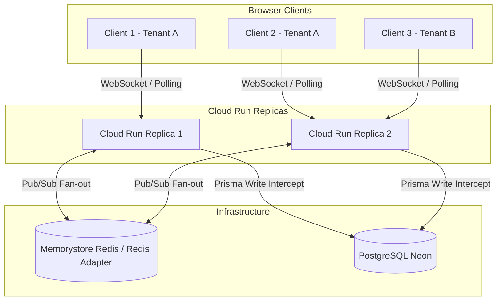

# Socket.IO Realtime & Multi-Instance Redis Scaling Runbook

This runbook guides operators, platform administrators, and engineers on configuring, running, and scaling Socket.IO realtime communication across Cloud Run instances in Auto Core Platform.

---

## 1. Architecture Overview

Auto Core Platform uses Socket.IO (`/dashboard-realtime` namespace with path `/api/socket.io`) to stream mutations (`entity_updated` events and `auth:claims_updated` events) to connected frontend clients in real time.



### Cloud Run WebSocket Requirements (Phase A)

Cloud Run manages serverless HTTP/WebSocket containers. Without explicit flags, idle WebSockets are dropped when CPU is throttled between HTTP requests, and instances scale to zero:

- **`--min-instances 1`**: Prevents cold starts and keeps at least one instance alive to maintain long-lived WebSocket connections.
- **`--no-cpu-throttling`**: Allocates CPU continuously outside active requests so background WebSocket ping/pong heartbeats are never starved.
- **`--max-instances 1` (Single-instance mode)**: When running without Redis, keeping `max-instances 1` prevents split-brain (where a mutation on replica A fails to notify a socket connected to replica B).

### Redis Pub/Sub Adapter (Phase B)

When running multiple Cloud Run instances (`--max-instances > 1`), Socket.IO uses `@socket.io/redis-adapter` powered by `ioredis`.
When `REDIS_URL` is set, `DashboardGateway` creates pub/sub Redis clients and attaches the adapter so room broadcasts (`tenant_{tenantId}`, `user_{userId}`) fan out across all replicas.
If `REDIS_URL` is unset, `DashboardGateway` falls back to the in-memory adapter (used for local development and e2e testing).

---

## 2. Provisioning Memorystore Redis in GCP (Operator Guide)

To scale `core-api` horizontally past 1 instance in production:

### Step 2.1: Create Memorystore Redis Instance

Run the following in `europe-west3` (same region as Cloud Run):

```bash
gcloud redis instances create acp-redis-realtime \
  --size=1 \
  --region=europe-west3 \
  --zone=europe-west3-a \
  --redis-version=redis_7_0 \
  --tier=basic \
  --network=default \
  --project=auto-core-platform
```

Note the assigned Redis **Host** and **Port** from the output:
```bash
gcloud redis instances describe acp-redis-realtime \
  --region=europe-west3 \
  --project=auto-core-platform \
  --format="value(host,port)"
```

### Step 2.2: Ensure VPC Egress for Cloud Run

Memorystore uses private RFC 1918 IP addresses. Cloud Run requires a VPC connector or Direct VPC egress to communicate with Memorystore:

1. **Create a Serverless VPC Access Connector** (if not already existing):
   ```bash
   gcloud compute networks vpc-access connectors create acp-vpc-connector \
     --network=default \
     --region=europe-west3 \
     --range=10.8.0.0/28 \
     --project=auto-core-platform
   ```

2. Alternatively, configure **Direct VPC egress** on the Cloud Run service.

### Step 2.3: Store `REDIS_URL` in Google Secret Manager (GSM)

Construct the Redis connection URL (e.g. `redis://10.0.0.3:6379`) and store it as a GSM secret:

```bash
echo -n "redis://<REDIS_HOST>:<REDIS_PORT>" | \
  gcloud secrets create REDIS_URL \
    --data-file=- \
    --project=auto-core-platform
```

Grant the Cloud Run service account access to read `REDIS_URL`:
```bash
gcloud secrets add-iam-policy-binding REDIS_URL \
  --member="serviceAccount:<SERVICE_ACCOUNT>@auto-core-platform.iam.gserviceaccount.com" \
  --role="roles/secretmanager.secretAccessor" \
  --project=auto-core-platform
```

---

## 3. Updating Cloud Run for Horizontal Scale-Out

Once Redis and the VPC connector are provisioned:

1. In `cloudbuild.yaml` (or via `gcloud run deploy`), update:
   - Add `REDIS_URL=REDIS_URL:latest` to `--set-secrets`.
   - Add `--vpc-connector acp-vpc-connector` (or `--network default --subnet default`).
   - Increase `--max-instances` (e.g. `--max-instances 5` or higher).

Example deploy command:
```bash
gcloud run deploy core-api \
  --image europe-west3-docker.pkg.dev/auto-core-platform/core-services/core-api:latest \
  --region europe-west3 \
  --project auto-core-platform \
  --allow-unauthenticated \
  --min-instances 1 \
  --no-cpu-throttling \
  --max-instances 5 \
  --vpc-connector acp-vpc-connector \
  --set-secrets "DATABASE_URL=DATABASE_URL_UAT:latest,REDIS_URL=REDIS_URL:latest,..."
```

---

## 4. Verification & Diagnostics

### Eager Connection & Fail-Closed Safety
When `core-api` boots with `REDIS_URL` set:
1. `DashboardGateway` eagerly connects `pubClient` and `subClient` before attaching the adapter.
2. The success log is ONLY emitted once both Redis clients have successfully connected:
   ```
   [DashboardGateway] Attached Redis adapter to Socket.IO for cross-instance fan-out.
   ```
3. **Fail-Closed in Production**: In `NODE_ENV=production`, if `REDIS_URL` is specified but cannot connect (e.g. invalid host, VPC connector missing, or bad credentials), `DashboardGateway` throws a `CRITICAL` startup error to prevent silent split-brain operation under multi-instance deployments.
4. If a connection drops post-startup, client errors are logged:
   ```
   [DashboardGateway] Redis pub client error: connect ECONNREFUSED ...
   ```

### Multi-Instance Realtime Verification
1. Connect Browser Client A to Replica 1 and Browser Client B to Replica 2 (both logged into Tenant A).
2. Perform a mutation on Client A (e.g. update a customer or workshop order).
3. Verify that Client B receives `entity_updated` immediately and invalidates the corresponding TanStack Query cache.

---

## 5. Local Development & E2E Testing

For local development and automated e2e test runs:
- Leave `REDIS_URL` unset in `.env` / test environment.
- Socket.IO will automatically run in in-memory mode without requiring Docker Redis or external network services.
- If testing multi-replica fan-out locally, start a local Redis instance (`redis-server` or `docker run -p 6379:6379 redis:7`) and set `REDIS_URL=redis://localhost:6379`.
